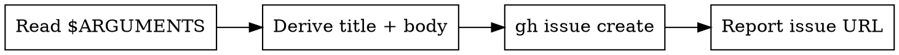

I'm using the sdlc:capture skill to quickly capture this idea.

**CAPTURE, DON'T DESIGN**

<HARD-GATE>
Do NOT ask clarifying questions, assess scope, or brainstorm. Create the issue and report back. If the idea needs fleshing out, tell the user to run sdlc:define.
</HARD-GATE>

## Process Flow



---

This is a no-ceremony skill — no context loading, no upstream artifact reading, no brainstorming phases. Just create the issue and report back.

### Instructions

1. Read the description from `$ARGUMENTS`.
2. Derive a **concise issue title** (under 80 characters) that captures the essence of the idea.
3. Structure the issue body with the full description.
4. Create the issue:

```bash
gh issue create \
  --title "<derived concise title>" \
  --label "triage" \
  --body "$(cat <<'EOF'
## Description
<full description from $ARGUMENTS>

## Status
Captured via sdlc:capture. Run `/sdlc:define` to flesh out when ready.
EOF
)"
```

Report the created issue number and URL to the user.

Note: `sdlc:reconcile` flags triage issues older than 14 days so nothing gets lost.
