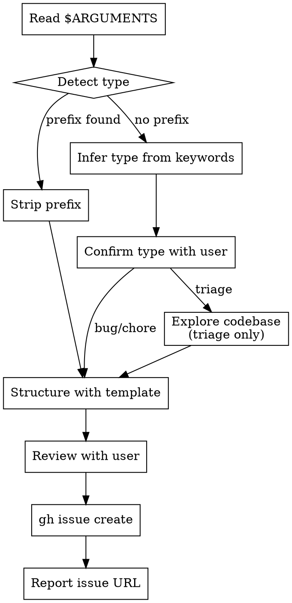

I'm using the sdlc:capture skill to capture this.

**CAPTURE WITH CONTEXT**

<HARD-GATE>
Do NOT brainstorm solutions or design implementations — that's define's job. DO classify the type. DO structure with the appropriate template. DO review the structured capture with the user before creating. DO explore the codebase for context on triage captures.
</HARD-GATE>

## Process Flow



---

### Instructions

#### Step 1: Read and detect type

Read the description from `$ARGUMENTS`.

**Prefix detection (case-insensitive):**
- Starts with `bug:` or `bug ` → type = **bug**, strip the prefix
- Starts with `chore:` or `chore ` → type = **chore**, strip the prefix
- No prefix → go to keyword inference

**Keyword inference (no prefix):**
- Error/crash/fail/broken/regression signals → suggest **bug**
- Cleanup/refactor/migrate/update-deps/rename signals → suggest **chore**
- Everything else → suggest **triage**

Present your classification to the user:
> "This sounds like a **[type]**. Does that feel right, or should it be a [alternative]?"

Wait for confirmation before proceeding. If the user reclassifies, use their choice.

#### Step 2: Derive title

Derive a **concise issue title** (under 80 characters) that captures the essence.

#### Step 3: Structure with template

Load the template for the confirmed type from `${CLAUDE_PLUGIN_ROOT}/templates/<type>-template.md`. Use its sections as the issue body structure. Fill what you can from the description; use `[TBD]` for sections you can't fill.

**Bug — fill from description:**
- `## Description` — what's broken, error messages, symptoms
- `## Reproduction Steps` — steps from description, or "Not yet reproduced — captured from: [original description context]"
- `## Expected vs Actual Behavior` — from description or `[TBD]`
- `## Affected Areas` — if mentioned, otherwise `[TBD]`
- `## File Scope` — if mentioned, otherwise `[TBD]`
- `## Technical Notes` — `[TBD]` (filled by define)
- `## Dependencies` — `none` (capture doesn't assess dependencies)
- **Severity:** Ask the user for severity (critical/high/medium/low) if not already clear from the description. Default suggestion: `medium` unless the description indicates otherwise.
- **Priority:** Ask the user for priority (critical/high/medium/low) alongside severity. Default suggestion: match severity unless the user indicates otherwise.

**Chore — fill from description:**
- `## Description` — what needs doing and why
- `## Task` — the specific work
- `## Acceptance Criteria` — if determinable, otherwise `[TBD]`
- `## File Scope` — if mentioned, otherwise `[TBD]`
- `## Technical Notes` — `[TBD]` (filled by define)
- `## Dependencies` — `none`
- No `## Parent` section at capture time (standalone by default; can be added via `/sdlc:define chore #N` later)

**Triage — explore first, then fill:**
- **Before structuring**, explore the codebase for context:
  - Search for files related to the description keywords using Grep
  - Check recent git history for related changes: `git log --oneline -20`
  - Scan open issues for related work: `gh issue list --state open --limit 20`
- `## Description` — what was observed or reported
- `## Initial Analysis` — findings from your codebase exploration
- `## Possible Causes` — hypotheses based on the analysis
- `## Suggested Next Steps` — what to do next: define as feature? investigate as bug? handle as chore?
- `## Dependencies` — `none`

#### Step 4: Review with user

Present the structured issue to the user. Show the full body, not a summary.

For bug/chore:
> "Here's what I captured. Anything to add or change?"

For triage:
> "Here's what I found after exploring the codebase. Anything to add before I create the issue?"

Wait for user approval. Incorporate any feedback. Do NOT create the issue until the user confirms.

#### Step 5: Create issue

Create the issue with the appropriate labels:

- **Bug:** `--label "type:bug"`, `--label "severity:<level>"`, and `--label "priority:<level>"` (severity and priority are always captured in Step 3)
- **Chore:** `--label "type:chore"`
- **Triage:** `--label "triage"`

```bash
gh issue create \
  --title "<derived title>" \
  --label "<type label>" \
  --body "<structured body>"
```

#### Step 6: Report and suggest next steps

Report the created issue number and URL.

For bugs and chores:
> "If this needs deeper investigation or decomposition, run `/sdlc:define bug #N` or `/sdlc:define chore #N`."

For triage:
> "Run `/sdlc:define` to flesh out when ready."

Note: `sdlc:reconcile` flags triage issues older than 14 days so nothing gets lost.
