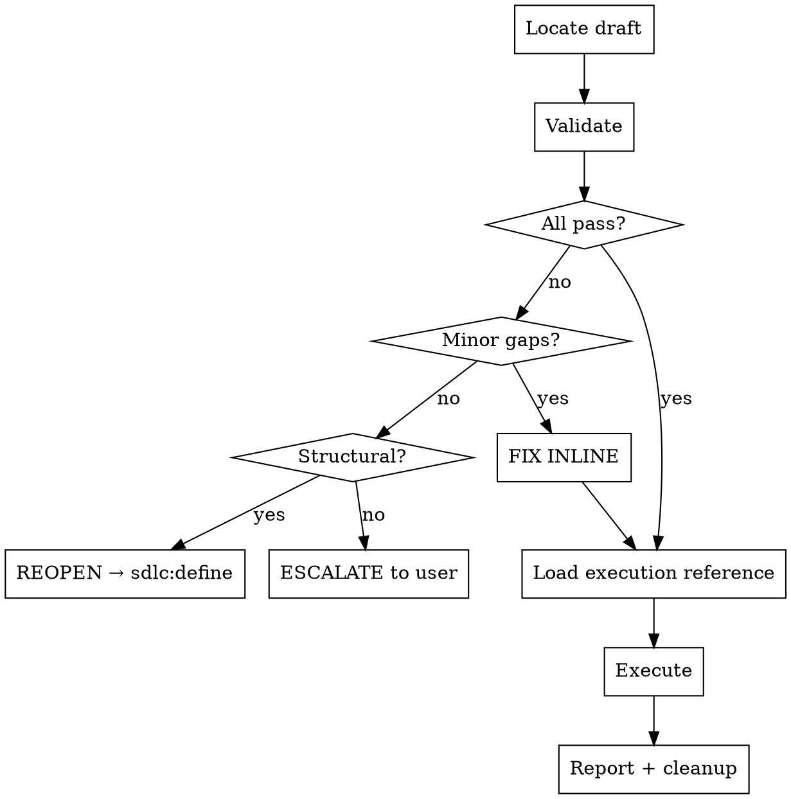

I'm using the sdlc:create skill to push the draft to its final destination.

**NO CREATIVE DECISIONS — EXECUTE THE DRAFT**

<HARD-GATE>
Do NOT ask creative questions, brainstorm alternatives, or modify draft content. Your job is validation and execution. If the draft needs creative changes, escalate back to sdlc:define.
</HARD-GATE>

## Process Flow



---

This skill is a **one-way valve**: draft in, artifacts out. It never brainstorms, never asks creative questions, and never invents content. If the draft is incomplete, it redirects back to `sdlc:define`.

---

## Red Flags (anti-rationalization)

Before starting, internalize these. Check back if you feel tempted to improvise.

| Thought | Reality |
|---------|---------|
| "The draft has issues but I can work around them" | Validate first. FIX INLINE for trivial issues. Redirect to sdlc:define for structural problems. |
| "Let me ask the user what they meant" | This skill doesn't ask creative questions. If the draft is ambiguous, redirect to sdlc:define. |
| "I'll create the issues without the draft template" | Always follow the level-specific execution reference. Never improvise the issue body format. |
| "I can skip validation, the draft looks fine" | Step 2 is mandatory. Every draft gets validated against the required fields checklist. |
| "The parent issue doesn't need updating" | Bidirectional linking is mandatory for GitHub artifacts. Always update parent checklists and dependency sections. |
| "I'll update the PI file later" | PI.md updates happen in the same execution flow. Never defer them. |

---

## Step 1: Locate Draft

### 1a. Parse Level

Extract the artifact level from `$ARGUMENTS`. Valid levels: `prd`, `pi`, `epic`, `feature`, `story`.

- If `$ARGUMENTS` contains a level keyword and a name, look for `.claude/sdlc/drafts/<level>-<name>.md`.
- If `$ARGUMENTS` contains only a level keyword, scan `.claude/sdlc/drafts/` for all files matching `<level>-*.md`.
- If `$ARGUMENTS` is empty, scan `.claude/sdlc/drafts/` and show all available drafts.

### 1b. Resolve Draft File

```bash
ls .claude/sdlc/drafts/
```

- **No drafts found:** "No drafts found. Run `/sdlc:define <level>` first." STOP.
- **One matching draft:** Use it. Announce: "Found draft: `<filename>`"
- **Multiple drafts of the same level:** List them and ask which one:
  > "I see `epic-auth.md` and `epic-search.md`. Which one?"
  STOP and wait for user response.

### 1c. Read Draft

```
Read .claude/sdlc/drafts/<filename>
```

Parse the YAML frontmatter to extract: `type`, `name`, `priority`, `areas`, `status`, `parent-epic`, `parent-feature` (where applicable).

### 1d. Load Execution Reference

```
Read ${CLAUDE_PLUGIN_ROOT}/skills/create/reference/<level>-execution.md
```

If the file does not exist or fails to load, STOP and tell the user: "The execution reference for `<level>` is missing. Cannot proceed."

---

## Step 2: Validate Draft

Check the draft against the required fields listed in the execution reference. Classify each problem found.

### Three-tier routing on validation failure

**FIX INLINE** if:
- 1 missing metadata field (priority, area, label) that can be inferred from context
- Formatting or template issues only (wrong heading level, missing blank line)

Action: Show the fix, apply it to the draft file, continue execution.

> "The draft is missing `priority`. Based on the parent epic (#42, priority: high), I'm setting it to `high`."

**REOPEN DRAFT** if:
- 1-2 content gaps (missing acceptance criteria, wrong dependency reference, incomplete description)
- Fields that need user input but scope is unchanged

Action: Show the problem, propose a fix, wait for user confirmation, update the draft file, continue execution.

> "The draft references `Blocked by: #99` but issue #99 doesn't exist. Did you mean #98 (token encryption story)?"

**ESCALATE TO DEFINE** if:
- 3+ content gaps
- Structural issues (wrong parent reference, scope mismatch with parent, level mismatch)
- Circular dependencies detected (A blocks B blocks A)

Action: STOP and redirect.

> "This draft has 4 issues: [list]. Run `/sdlc:define <level>` to rework it."

### Validation passes

If all required fields are present and correct, announce:

> "Draft validated. Proceeding to create."

---

## Step 3: Execute

Follow the instructions in the execution reference loaded in Step 1d. The reference contains:

- Required fields checklist (used in Step 2)
- Exact `gh` CLI commands for GitHub artifacts
- Exact `git` commands for file-based artifacts
- Parent/PI update procedures
- Bidirectional dependency linking steps

**Do not deviate from the execution reference.** It contains the canonical procedure for each level.

---

## Step 4: Report & Cleanup

### 4a. Report

Show what was created. Format depends on the level:

**For file-based artifacts (PRD, PI):**

> Created: `.claude/sdlc/prd/PRD.md` v1.0
> Committed: `docs(prd): create PRD v1.0`

**For GitHub artifacts (epic, feature, story):**

> **Created:**
> - Epic: #125 — "User Authentication"
>   - Labels: `type:epic`, `priority:high`, `area:auth`
> - Feature stub: #126 — "Google OAuth Flow"
> - Feature stub: #127 — "Token Management"
>
> **Updated:**
> - PI.md: replaced `#TBD` with #125
> - Committed: `docs(pi): add issue numbers for epic User Authentication (#125)`

### 4b. Cleanup

Ask the user:

> "Delete `.claude/sdlc/drafts/<filename>`?" (default: yes)

- If yes (or user just presses enter): delete the draft file.
- If no: leave the draft. Note that `sdlc:status` will flag it as stale after 7 days.

```bash
rm .claude/sdlc/drafts/<filename>
```

---

## Execution Checklist

Before finishing, verify ALL steps were completed:

- [ ] Step 1: Draft located and read
- [ ] Step 1d: Execution reference loaded
- [ ] Step 2: Draft validated (all required fields present)
- [ ] Step 3: Execution reference followed completely
- [ ] Step 4a: Report shown to user
- [ ] Step 4b: Cleanup offered

If any step was skipped, GO BACK and complete it now.
