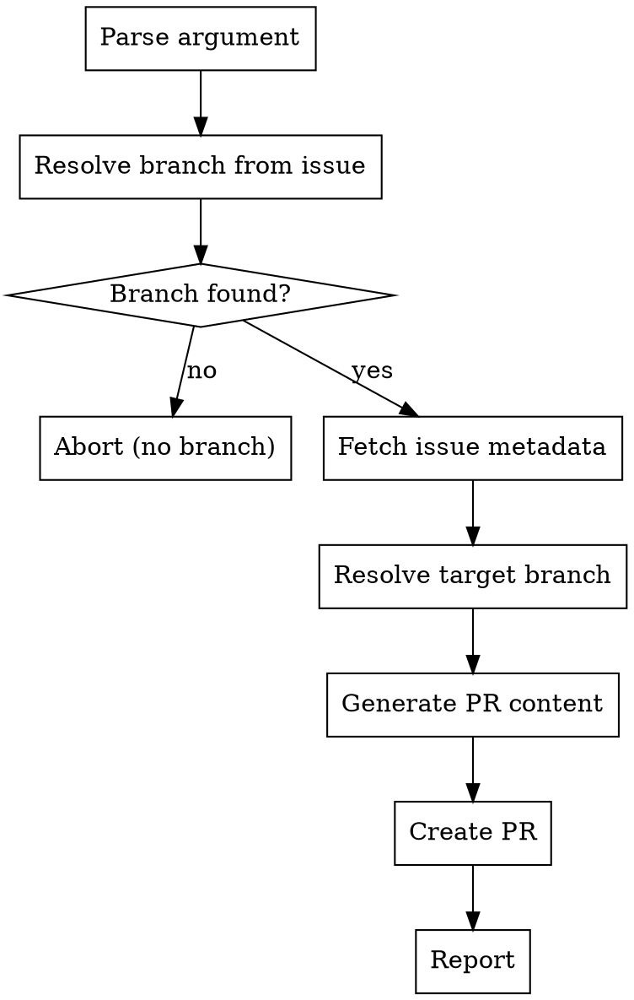

# Finish Dev

Create a PR to merge an issue's branch into its parent branch.

<HARD-GATE>
Do NOT modify issues or labels. This skill only creates a PR.
</HARD-GATE>

## Process Flow



---

## Step 1: Parse Argument

Extract the issue number from `$ARGUMENTS`. Expected format: `#42` or `42`.

If no issue number is provided, **abort** with:

> "Usage: `/sdlc:finish-dev #<issue-number>`"

## Step 2: Resolve Branch from Issue

```bash
gh issue develop <ISSUE_NUM> --list
```

- **No branch found** → abort: "Issue #`<ISSUE_NUM>` has no linked branch. Nothing to close out."
- **Exactly one branch** → store as `BRANCH_NAME`
- **Multiple branches** → present the list and ask the user to pick one. Store selection as `BRANCH_NAME`.

## Step 3: Fetch Issue Metadata

```bash
gh issue view <ISSUE_NUM> --json title,labels,body,state
```

Extract:
- `ISSUE_TITLE` from the title
- `LEVEL` from the `type:*` label (`type:epic` → `epic`, `type:feature` → `feature`, `type:story` → `story`, `type:bug` → `bug`, `type:chore` → `chore`). If no `type:*` label is found, default to `feat`.
- `ISSUE_BODY` from the body

**Gather children (for PR body only — not a gate):**

Based on level, check for a child section in the issue body:

| Level | Section to parse |
|-------|-----------------|
| `feature` | `## Stories` |
| `epic` | `## Features` |

If a matching section exists, extract issue numbers (`#N`) from checklist items. Store as `CHILDREN` for use in Step 5. If no section or no issue numbers found, `CHILDREN` is empty — this is fine, proceed normally.

## Step 4: Resolve Target Branch

**Phase 1: Parse `## Parent` section.** Extract from the issue body, checking fields in priority order:
1. `Feature: #N` → candidate = N
2. `Epic: #N` → candidate = N
3. `PI: #N` → candidate = N

First match wins. Set `PARENT_ISSUE` to the extracted number.

**Phase 2: Resolve parent's branch.**

If a `PARENT_ISSUE` was found:

```bash
gh issue develop <PARENT_ISSUE> --list
```

- **No branch found:** Prompt the user:
  > "Parent #N has no linked branch. Provide a target branch name, or press enter to target `main`."
- **Exactly one branch:** `TARGET_BRANCH=<that branch>` — use it automatically.
- **Multiple branches:** Present the list and ask the user to pick one.

**If no `## Parent` section found:** Prompt the user:
> "No parent found in issue #`<ISSUE_NUM>`. Provide a target branch name, or press enter to target `main`."

## Step 5: Generate PR Content

Load the reference template from `${CLAUDE_PLUGIN_ROOT}/skills/finish-dev/reference/pr-template.md` for structural guidance.

**PR Title:**

Conventional format based on level:
- `feature` → `feat(#N): <slugified-issue-title>`
- `epic` → `epic(#N): <slugified-issue-title>`
- `story` → `feat(#N): <slugified-issue-title>`
- `bug` → `fix(#N): <slugified-issue-title>`
- `chore` → `chore(#N): <slugified-issue-title>`

The slug comes from the **issue title**. Lowercase, spaces to hyphens, strip special characters.

**PR Body:**

Populate the template with real content:

1. **Summary section:** 1-2 sentence overview of what this branch delivers.

2. **Child Issues table** (if `CHILDREN` is non-empty): List every child issue with issue number and title.

3. **Test Plan section:** This is NOT template-based. Read the following context and synthesize a substantive, specific verification plan:
   - The PR diff: `git diff <TARGET_BRANCH>...<BRANCH_NAME>`
   - The current issue body (description, acceptance criteria)
   - Child issue titles and descriptions (if any)

   The test plan should include:
   - Functional verification steps tied to acceptance criteria
   - Integration checks (do the pieces work together?)
   - Regression considerations (what could this break?)
   - Edge cases surfaced by the diff

4. **Closes footer:** `Closes #<ISSUE_NUM>`

## Step 6: Create PR

```bash
gh pr create \
  --head <BRANCH_NAME> \
  --base <TARGET_BRANCH> \
  --title "<PR_TITLE>" \
  --body "<PR_BODY>"
```

**Handle failures:**
- Branch has no commits ahead of target: "This branch has no new commits compared to `<TARGET_BRANCH>`. Nothing to PR."
- PR already exists: "A PR already exists for this branch. View it at \<URL\>."

Store the resulting PR URL as `PR_URL`.

## Step 7: Report

Display to the user:

> **PR Created:**
> - PR: \<PR_URL\>
> - Branch: `<BRANCH_NAME>` → `<TARGET_BRANCH>`
> - Issue: #\<ISSUE_NUM\> — "\<ISSUE_TITLE\>"
>
> The PR will close #\<ISSUE_NUM\> when merged.

---

## Execution Checklist

- [ ] Step 1: Issue number parsed from arguments
- [ ] Step 2: Linked branch resolved
- [ ] Step 3: Issue metadata fetched, children gathered (if any)
- [ ] Step 4: Target branch resolved
- [ ] Step 5: PR title, body, and test plan generated
- [ ] Step 6: PR created via `gh pr create`
- [ ] Step 7: Summary reported
