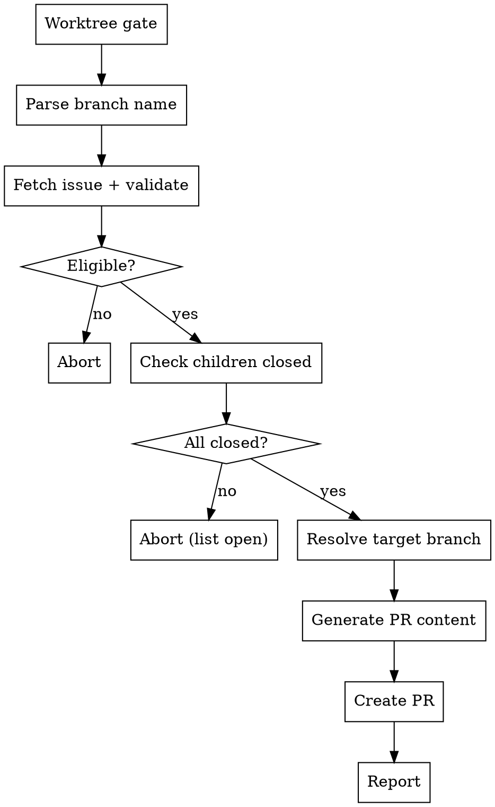

# Finish Dev

Close out a roll-up branch by creating a PR to merge it into its parent branch.

<HARD-GATE>
Do NOT create a PR if any child issues are still open. Do NOT modify issues or labels. This skill only creates a PR.
</HARD-GATE>

## Process Flow



---

## Step 1: Worktree Gate

Verify this is a git worktree, not the main checkout:

```bash
GIT_DIR=$(git rev-parse --git-dir)
GIT_COMMON=$(git rev-parse --git-common-dir)
test "$GIT_DIR" != "$GIT_COMMON"
```

This works from any subdirectory within the worktree.

If the test fails (values are equal), this is the main checkout. **Abort** with:

> "This skill requires a git worktree. Start one with `claude -w` and try again."

## Step 2: Parse Current Branch Name

Extract the level and issue number from the current branch:

```bash
CURRENT_BRANCH=$(git branch --show-current)
```

Parse with regex pattern: `^(pi|epic|feature)/(\d+)-(.+)$`

Extract:
- `LEVEL` from capture group 1
- `ISSUE_NUM` from capture group 2

If the branch name does not match the pattern, **abort** with:

> "Current branch `<CURRENT_BRANCH>` does not follow the `<level>/<number>-<slug>` convention. This skill only works on branches created by setup-dev."

## Step 3: Fetch Issue and Validate Eligibility

```bash
gh issue view <ISSUE_NUM> --json title,labels,body,state
```

Extract:
- `ISSUE_TITLE` from the title
- `ISSUE_STATE` from state
- Labels list

**Eligibility gate — only the following are allowed:**

| Level | Requirement |
|-------|------------|
| `feature` | Must have `size:large` label |
| `epic` | Always eligible |
| `pi` | Always eligible |

**Reject with clear messages:**

- If level is `feature` but `size:large` is not present:
  > "Feature #`<ISSUE_NUM>` is `size:small` — small features don't use roll-up branches. Close this feature's PR directly."

- If level is `story`, `bug`, or `chore` (shouldn't match the branch regex, but guard anyway):
  > "`finish-dev` is for roll-up branches only (large features, epics, PIs). Stories, bugs, and chores should have their PRs merged directly."

## Step 4: Check Child Completion (Hard Block)

Determine the child section and expected child type based on level:

| Level | Section to parse | Child type |
|-------|-----------------|------------|
| `feature` (large) | `## Stories` | story |
| `epic` | `## Features` | feature |
| `pi` | `## Epics` | epic |

Parse the appropriate section from the issue body. Extract issue numbers from checklist items — the format is `- [ ] <text> (#N)` or `- [x] <text> (#N)` or variations with `#N` anywhere in the line. Extract all `#N` values using a regex like `#(\d+)`.

For each extracted child issue number, verify it is closed:

```bash
gh issue view <CHILD_NUM> --json state --jq '.state'
```

**If ANY child issue is not `CLOSED`, abort with:**

> "Cannot create PR — the following child issues are still open:
> - #X — \<title\> (OPEN)
> - #Y — \<title\> (OPEN)
>
> Close all child issues before running finish-dev."

**If the section is empty or no issue numbers are found, abort with:**

> "No child issues found in the `## <Section>` section of #`<ISSUE_NUM>`. Verify the issue body has a properly formatted checklist."

Store the list of child issue numbers and titles as `CHILDREN` for use in Step 6.

## Step 5: Resolve Target Branch

**For PI level:** target branch is always `main`. Skip parent resolution entirely.

**For epic and feature levels:**

**Phase 1: Parse `## Parent` section.** Extract from the issue body, checking fields in priority order:
1. `Epic: #N` → candidate = N (for features)
2. `PI: #N` → candidate = N (for epics)

First match wins. Set `PARENT_ISSUE` to the extracted number.

**Phase 2: Resolve parent's branch.**

```bash
gh issue develop <PARENT_ISSUE> --list
```

- **No branch found and parent is a PI issue:** `TARGET_BRANCH=main`
- **No branch found (non-PI parent):** Prompt the user:
  > "Parent #N has no linked branch. Provide a target branch name, or press enter to target `main`."
- **Exactly one branch:** `TARGET_BRANCH=<that branch>` — use it automatically, no prompt needed.
- **Multiple branches:** Present the list and ask the user to pick one.

**If no `## Parent` section found:** Prompt the user:
> "No parent found in issue #`<ISSUE_NUM>`. Provide a target branch name, or press enter to target `main`."

## Step 6: Generate PR Content

Load the reference template from `${CLAUDE_PLUGIN_ROOT}/skills/finish-dev/reference/pr-template.md` for structural guidance.

**PR Title:**

Conventional format based on level:
- Feature: `feat(#N): <slugified-issue-title>`
- Epic: `epic(#N): <slugified-issue-title>`
- PI: `pi(#N): <slugified-issue-title>`

The slug comes from the **issue title** (not the branch slug). Lowercase, spaces to hyphens, strip special characters.

**PR Body:**

Populate the template with real content:

1. **Summary section:** 1-2 sentence overview of what this branch delivers as an aggregate.

2. **Child Issues table:** List every child issue from `CHILDREN` (gathered in Step 4) with issue number and title.

3. **Test Plan section:** This is NOT template-based. Read the following context and synthesize a substantive, specific verification plan:
   - The PR diff: `git diff <TARGET_BRANCH>...HEAD`
   - The current issue body (description, acceptance criteria)
   - Each child issue's title and description

   The test plan should include:
   - Functional verification steps tied to acceptance criteria
   - Integration checks (do the pieces work together?)
   - Regression considerations (what could this break?)
   - Edge cases surfaced by the diff

4. **Closes footer:** `Closes #<ISSUE_NUM>`

## Step 7: Create PR

```bash
gh pr create \
  --base <TARGET_BRANCH> \
  --title "<PR_TITLE>" \
  --body "<PR_BODY>"
```

**Handle failures:**
- Branch has no commits ahead of target: "This branch has no new commits compared to `<TARGET_BRANCH>`. Nothing to PR."
- PR already exists: "A PR already exists for this branch. View it at \<URL\>."

Store the resulting PR URL as `PR_URL`.

## Step 8: Report

Display to the user:

> **PR Created:**
> - PR: \<PR_URL\>
> - Branch: `<CURRENT_BRANCH>` → `<TARGET_BRANCH>`
> - Issue: #\<ISSUE_NUM\> — "\<ISSUE_TITLE\>"
> - Children merged: \<count\> \<child-type\>(s)
>
> The PR will close #\<ISSUE_NUM\> when merged.

---

## Execution Checklist

- [ ] Step 1: Worktree verified
- [ ] Step 2: Branch name parsed (level=`<LEVEL>`, issue=`<ISSUE_NUM>`)
- [ ] Step 3: Issue fetched and eligibility validated
- [ ] Step 4: All child issues verified CLOSED
- [ ] Step 5: Target branch resolved
- [ ] Step 6: PR title, body, and test plan generated
- [ ] Step 7: PR created via `gh pr create`
- [ ] Step 8: Summary reported
