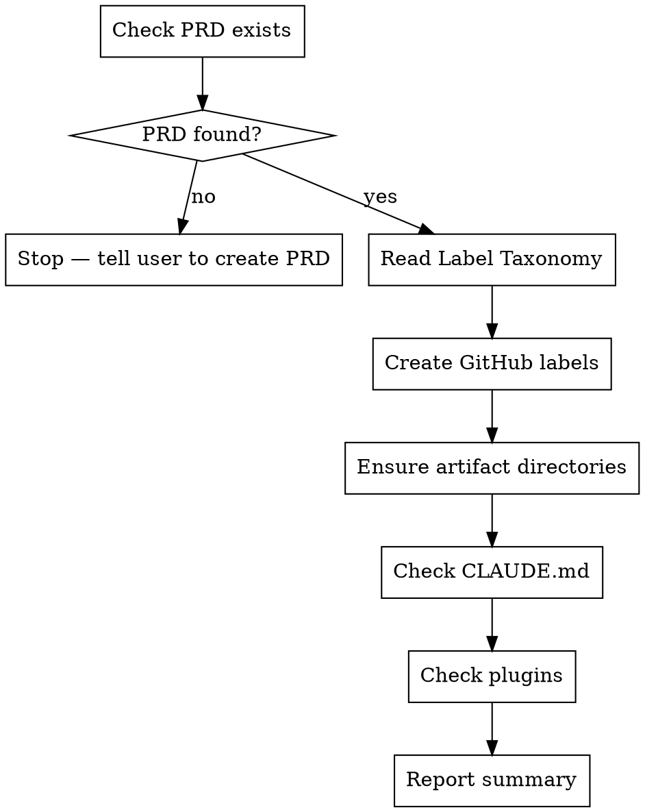

I'm using the sdlc:init skill to bootstrap SDLC infrastructure for this project.

**BOOTSTRAP, DON'T BUILD**

<HARD-GATE>
Do NOT define artifacts, brainstorm, or create issues. Only set up infrastructure. If the PRD doesn't exist, tell the user to run sdlc:define prd first.
</HARD-GATE>

## Process Flow



---

## Step 1: Validate PRD Exists

```
Read .claude/sdlc/prd/PRD.md
```

If the file does not exist, report:

> "No PRD found at `.claude/sdlc/prd/PRD.md`. Run `sdlc:define prd` followed by `sdlc:create prd` first."

STOP. Do not proceed further.

---

## Step 2: Read Label Taxonomy

Parse the PRD for a `## Label Taxonomy` section. If found, scan the table and extract all values matching the `area:<name>` pattern from any cell. Labels may appear comma-separated within a single cell (e.g., `area:skills`, `area:agents`, `area:templates` in one row). Collect all unique area names into `AREA_LABELS`.

If no Label Taxonomy section exists, announce:

> "PRD does not have a Label Taxonomy section. I'll create universal labels only. Consider running `sdlc:update prd` to add a Label Taxonomy section, then re-run `sdlc:init`."

Record: `AREA_LABELS` (list of area names, possibly empty).

---

## Step 3: Create GitHub Labels

Create all labels using `--force` for idempotency (creates if missing, updates color if exists).

```bash
# Type labels (semantic colors per type)
gh label create "type:pi" --color "5319e7" --force
gh label create "type:epic" --color "7057ff" --force
gh label create "type:feature" --color "0075ca" --force
gh label create "type:story" --color "e4e669" --force
gh label create "type:bug" --color "d93f0b" --force
gh label create "type:chore" --color "c5def5" --force

# Status labels (semantic colors per state)
gh label create "status:todo" --color "c5def5" --force
gh label create "status:in-progress" --color "fbca04" --force
gh label create "status:done" --color "0e8a16" --force
gh label create "status:blocked" --color "d93f0b" --force

# Priority labels (severity gradient)
gh label create "priority:critical" --color "b60205" --force
gh label create "priority:high" --color "d93f0b" --force
gh label create "priority:medium" --color "fbca04" --force
gh label create "priority:low" --color "c5def5" --force

# Size labels (yellow-green)
gh label create "size:small" --color "e4e669" --force
gh label create "size:large" --color "e4e669" --force

# Triage (yellow)
gh label create "triage" --color "fbca04" --force
```

Then for each area label from the PRD:

```bash
gh label create "area:<name>" --color "c2e0c6" --force
```

Track counts: how many labels were newly created vs already existed. The `--force` flag means existing labels are silently updated (color only), so count the total attempted.

---

## Step 4: Ensure Artifact Directories

```bash
mkdir -p .claude/sdlc/prd
mkdir -p .claude/sdlc/drafts
```

Add `.gitkeep` files to any empty directories:

```bash
for dir in .claude/sdlc/prd .claude/sdlc/drafts; do
  if [ -z "$(ls -A $dir 2>/dev/null)" ]; then
    touch "$dir/.gitkeep"
  fi
done
```

---

## Step 5: Check CLAUDE.md

```bash
grep -l "sdlc:" CLAUDE.md 2>/dev/null || grep -l ".claude/sdlc/" CLAUDE.md 2>/dev/null
```

If neither pattern is found in CLAUDE.md, suggest:

> "Your CLAUDE.md doesn't reference the SDLC workflow yet. Consider running the `claude-md-management:claude-md-improver` skill to add SDLC conventions based on your PRD."

If found, report: "CLAUDE.md already references SDLC workflow."

---

## Step 6: Check Recommended Plugins

Check for key plugins. This is informational only — do not install anything.

Report which of the following are available:
- `superpowers` — workflow discipline (brainstorming, TDD, verification)
- `commit-commands` — conventional commit helpers

If any are missing, suggest: "Consider enabling [plugin] for [benefit]."

---

## Step 7: Report Summary

Present a summary:

Compute label counts from the labels actually created in Step 3: count the universal labels (type + status + priority + size + triage) and the area labels separately, then sum for the total.

```
## SDLC Init Complete

**Labels:**
- Universal: <count> labels (type, status, priority, size, triage)
- Project areas: <count> labels from PRD Label Taxonomy
- Total: <sum> labels ensured

**Directories:**
- .claude/sdlc/prd/ ✓
- .claude/sdlc/drafts/ ✓

**CLAUDE.md:** [references SDLC | needs SDLC sections — see suggestion above]

**Plugins:** [all recommended present | missing: X — see suggestions above]

**Next step:** Run `sdlc:define pi` to plan your first increment.
```

---

## Execution Checklist

- [ ] Step 1: PRD existence verified
- [ ] Step 2: Label Taxonomy read (or noted as missing)
- [ ] Step 3: All GitHub labels created
- [ ] Step 4: Artifact directories confirmed
- [ ] Step 5: CLAUDE.md checked
- [ ] Step 6: Plugins checked
- [ ] Step 7: Summary reported
