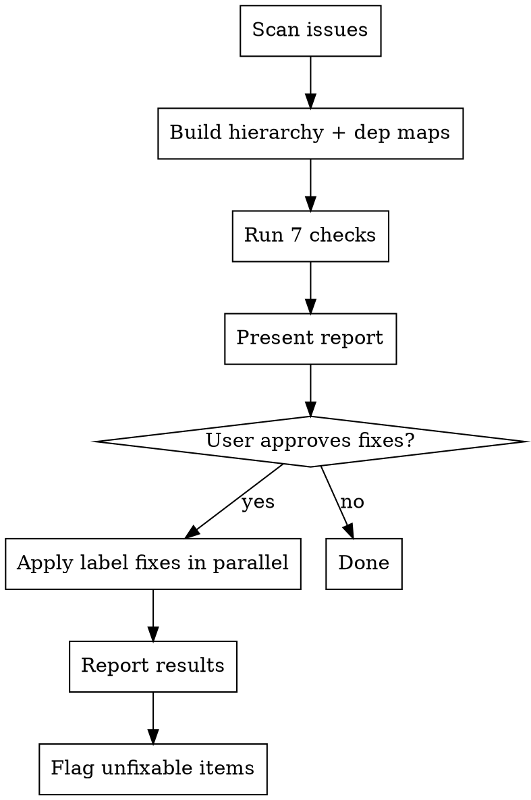

I'm using the sdlc:reconcile skill to audit the issue hierarchy.

**FIX LABELS, NOTHING ELSE**

<HARD-GATE>
Do NOT modify issue bodies, titles, or content. Only touch labels and open/closed state. If a fix requires content changes, flag it for sdlc:update.
</HARD-GATE>

## Process Flow



---

This skill **only touches labels and open/closed state** — it never edits issue bodies. All fixes are presented before any changes are made.

---

## Step 1: Scan

### 1a. Determine Scope

Parse `$ARGUMENTS`:

| Input | Scope |
|-------|-------|
| _(empty)_ | All areas |
| Area name | Issues with `area:<arg>` label only. Read `.claude/sdlc/prd/PRD.md` Label Taxonomy section to discover valid area names. If no PRD exists, treat any argument as a raw `area:<arg>` filter. |

Set `AREA_FILTER`:
- Empty: no extra flags
- Area provided: append `--label "area:<area>"` to `gh issue list` commands below

If `$ARGUMENTS` is non-empty, treat it as an area name and apply `--label "area:<arg>"` to all queries. If the filter returns no results, announce: "No issues found with label `area:<arg>`. Check the PRD's Label Taxonomy for valid areas, or run with no argument to scan all." and proceed with no filter.

### 1b. Fetch Issues

Run both queries now:

```bash
# All open issues
gh issue list \
  --state open \
  --json number,title,labels,body,state,createdAt \
  --limit 200 \
  [--label "area:<area>" if area filter]

# Recently closed issues (last 100)
gh issue list \
  --state closed \
  --json number,title,labels,body,state,closedAt \
  --limit 100 \
  [--label "area:<area>" if area filter]
```

### 1c. Build the Hierarchy Map

From the combined issue list, parse each issue body to extract structure:

**Parent extraction** — for each issue, find the `## Parent` section and extract the referenced issue number:
```
## Parent
- Feature: #42
```
→ parent of this issue is `#42`.

**Dependency extraction** — for each issue, find the `## Dependencies` section and extract:
- Lines matching `- Blocked by: #N` or `- Blocked by: #N, #M` (dash-prefixed) → this issue's blockers
- Lines matching `- Blocks: #N` or `- Blocks: #N, #M` (dash-prefixed) → issues this one blocks

Build two data structures:
- `parent_of[N]` → issue number of N's parent (or null)
- `children_of[P]` → list of issue numbers whose parent is P
- `blockers_of[N]` → list of issue numbers that must complete before N
- `blocks[N]` → list of issue numbers that N is blocking

---

## Step 2: Detect Problems by Severity

Work through each check below. Accumulate findings into three lists: CRITICAL, WARNING, INFO. Do not apply any fixes yet.

### CRITICAL Checks

#### C1: Circular Dependencies

For each open issue N, perform a depth-first walk on `blockers_of`:

```
walk(start, current, visited):
  for each blocker B in blockers_of[current]:
    if B == start → CIRCULAR DEPENDENCY detected: record the full cycle path
    if B in visited → skip (already explored this node)
    visited.add(B)
    walk(start, B, visited)
```

Record the full cycle path for each detected circular dependency. Example finding:
```
CRITICAL: Circular dependency — #52 → #48 → #52
```

#### C2: Broken Hierarchy

For each open issue with a `## Parent` section:
- Extract the parent issue number
- Check if that number exists in the fetched issue set (open or recently closed)
- If the parent does NOT exist → broken hierarchy
- If the parent's type label is inconsistent (e.g., story's parent is also a story instead of a feature) → broken hierarchy

**Exception:** If a story's `## Parent` section contains `- Feature: none` or `- Feature: none (flat epic)`, this is valid — the story is a direct child of the epic with no feature grouping. Do NOT flag this as a broken hierarchy. Only check that the `- Epic: #N` reference is valid.

Record findings:
```
CRITICAL: #77 references parent #999 which does not exist
CRITICAL: #55 (type:story) references parent #48 (type:story) — expected type:feature or type:epic
```

### WARNING Checks

#### W1: Stale Labels on Closed Issues

For each **closed** issue:
- Check if labels contain `status:in-progress` OR `status:todo`
- If yes → stale label

Fix: `gh issue edit <N> --add-label "status:done" --remove-label "status:in-progress" --remove-label "status:todo"`

Record finding:
```
WARNING: #48 (closed) still has status:in-progress → fix to status:done
```

#### W2: Completed Parents Not Closed

For each **open** issue that has the `type:feature` or `type:epic` label:
- Look up `children_of[N]` from the map built in Step 1c
- A parent is **complete** when ALL its children satisfy BOTH conditions:
  - Has `status:done` label, AND
  - Is in `CLOSED` state
- If all children are complete AND the parent is still open → close the parent

Fix:
```bash
gh issue edit <N> --add-label "status:done"
gh issue close <N> --reason completed --comment "All child issues are done. Auto-closed by sdlc:reconcile."
```

Record finding:
```
WARNING: #45 Feature: all 3 child stories done → close feature, apply status:done
```

If a parent has zero children in the map, skip it — cannot determine completion.

#### W3: Blocker Mismatch (should be blocked)

For each **open** issue with label `status:todo`:
- Look up `blockers_of[N]`
- For each blocker B, check if B is **satisfied**: `state == "CLOSED"` OR labels contain `"status:done"`
- If ANY blocker is unmet (open without `status:done`) → this issue should be `status:blocked`

Fix: `gh issue edit <N> --add-label "status:blocked" --remove-label "status:todo"`

Record finding:
```
WARNING: #52 has status:todo but blocked by open #48 → fix to status:blocked
```

#### W4: Unblocked but Still Blocked

For each **open** issue with label `status:blocked`:
- Look up `blockers_of[N]`
- If blockers list is empty → no blockers recorded; flag as unblocked
- If ALL blockers B are satisfied (`state == "CLOSED"` OR labels contain `"status:done"`) → issue should be `status:todo`

Fix: `gh issue edit <N> --add-label "status:todo" --remove-label "status:blocked"`

Record finding:
```
WARNING: #60 has status:blocked but all blockers are done → fix to status:todo
```

### INFO Checks

#### I1: Orphaned References

For each open issue N, look at `blockers_of[N]` (issues that N says block it):
- For each blocker B, check if `blocks[B]` contains N
- If B does NOT list N in its `Blocks:` field → orphaned reference

Record finding:
```
INFO: #63 lists "Blocked by #61" but #61 does not list "Blocks #63"
```

#### I2: Priority Mismatch

For each open issue with a parent:
- Extract the priority label of the child (e.g., `priority:critical`)
- Extract the priority label of the parent
- Priority rank: critical=1, high=2, medium=3, low=4, none=5
- If child rank < parent rank (child is higher priority than parent) → mismatch

Record finding:
```
INFO: #77 (priority:critical) has higher priority than parent #45 (priority:medium)
```

#### I3: Stale Triage Issues

Compute the cutoff date: today minus 14 days (ISO 8601, e.g. `2026-03-05`).

For each open issue with the `triage` label:
- Check `createdAt` against the cutoff
- If `createdAt` is before the cutoff → stale triage

Record finding:
```
INFO: #33 has triage label and is 21 days old — needs definition or closure
```

---

## Step 3: Present Findings

Output the reconciliation report using this exact format:

```
## Reconciliation Report
Scope: <all areas / area:<name>>

### CRITICAL (<count>)
<list findings, or "No critical issues.">

### WARNING (<count>)
<list findings with proposed fix for each, or "No warnings.">

### INFO (<count>)
<list findings, or "No info items.">
```

**Example:**

```
## Reconciliation Report
Scope: all areas

### CRITICAL (0)
No critical issues.

### WARNING (4)
1. #48 (closed) still has status:in-progress → fix to status:done
2. #45 Feature: all 3 child stories done → close feature, apply status:done
3. #52 has status:todo but blocked by open #48 → fix to status:blocked
4. #60 has status:blocked but all blockers are done → fix to status:todo

### INFO (1)
1. #63 lists "Blocked by #61" but #61 does not list "Blocks #63"
```

After the report, output exactly:

```
Apply WARNING fixes? [y/n]
```

Wait for the user's response before proceeding. Do not apply any fixes until the user confirms.

---

## Step 4: Execute (on confirmation "y")

If the user responds "n" or anything other than "y", output: "No changes made." and stop.

On "y":

### 4a. Prepare Fix Commands

For each WARNING finding, build the exact `gh issue edit` or `gh issue close` command needed. Group fixes by type:

- **W1 (stale labels):** `gh issue edit` only
- **W2 (unclosed parents):** `gh issue edit` + `gh issue close` — the edit must run before close
- **W3 (should be blocked):** `gh issue edit` only
- **W4 (unblocked):** `gh issue edit` only

### 4b. Execute in Parallel Where Possible

Run independent fixes in parallel. Fixes are independent when they touch different issue numbers. Example:

```bash
# Run in parallel — different issues
gh issue edit 48 --add-label "status:done" --remove-label "status:in-progress" &
gh issue edit 52 --add-label "status:blocked" --remove-label "status:todo" &
gh issue edit 60 --add-label "status:todo" --remove-label "status:blocked" &
wait

# W2 requires sequential steps for the same issue
gh issue edit 45 --add-label "status:done"
gh issue close 45 --reason completed --comment "All child issues are done. Auto-closed by sdlc:reconcile."
```

### 4c. Report Results

After all commands complete, report per-issue outcome:

```
## Fix Results

- #48 ✓ status:in-progress → status:done
- #45 ✓ status:done applied, issue closed
- #52 ✓ status:todo → status:blocked
- #60 ✓ status:blocked → status:todo

4 fixes applied, 0 failed.
```

If any command fails, report the error verbatim:
```
- #48 ✗ FAILED: <error message from gh>
```

Do not retry failed commands. Surface them for the user to investigate.

---

## Step 5: Flag What This Skill Cannot Fix

After Step 4 (or immediately after Step 3 if the user declined), list items that require manual action:

**CRITICAL findings** (circular deps, broken hierarchy):
> These require body edits to fix. Run `/sdlc:update` to repair the issue content.
> - #52 → #48 → #52 (circular dependency)
> - #77 references nonexistent parent #999

**INFO: Orphaned references:**
> Run `/sdlc:update story #63` to add the missing `Blocks: #63` entry to #61.

**INFO: Priority mismatches and stale triage:**
> These are informational. Use your judgment — no automated fix is available.

If there are no unfixable items, omit this section.

---

## Blocker Satisfaction Rule

A blocker is **satisfied** (does not block) when:
- Its GitHub state is `CLOSED`, OR
- Its labels contain `status:done`

A blocker is **unmet** when:
- Its GitHub state is `OPEN`, AND
- Its labels do NOT contain `status:done`

---

## Parent Completion Rule

A parent issue (feature or epic) is **complete** when ALL of the following hold for every child issue:
- The child has the `status:done` label, AND
- The child is in `CLOSED` state

A parent with zero known children (no issues reference it as parent) is **not eligible** for auto-close.

---

## Execution Checklist

Before finishing, verify all steps were completed:

- [ ] Step 1a: Scope determined from `$ARGUMENTS`
- [ ] Step 1b: Open and recently closed issues fetched
- [ ] Step 1c: Parent map and dependency map built
- [ ] Step 2 C1: Circular dependency DFS walk completed
- [ ] Step 2 C2: Broken hierarchy checked for all issues with a `## Parent` section
- [ ] Step 2 W1: Stale labels checked on all closed issues
- [ ] Step 2 W2: Parent completion checked for all open features and epics
- [ ] Step 2 W3: Blocker mismatch checked for all open `status:todo` issues
- [ ] Step 2 W4: Unblocked-but-blocked checked for all open `status:blocked` issues
- [ ] Step 2 I1: Orphaned references checked across all open issues
- [ ] Step 2 I2: Priority mismatch checked for all open issues with a parent
- [ ] Step 2 I3: Stale triage checked against 14-day cutoff
- [ ] Step 3: Report presented and user asked "Apply WARNING fixes? [y/n]"
- [ ] Step 4: Fixes executed (or skipped on "n")
- [ ] Step 5: Unfixable items flagged with remediation instructions

If any check was skipped without a documented skip condition, complete it now before finishing.
