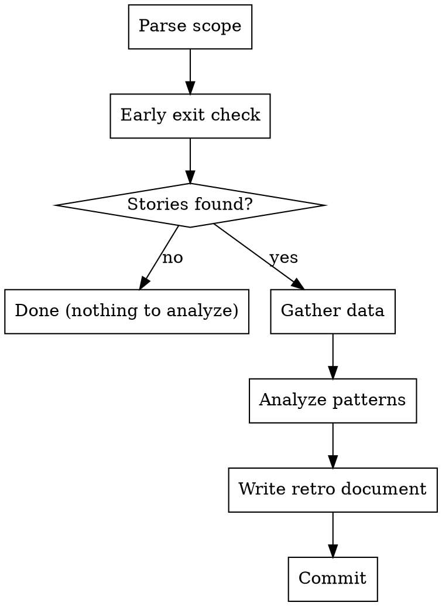

I'm using the sdlc:retro skill to run a retrospective on [scope].

**ANALYZE, DON'T JUDGE**

<HARD-GATE>
Do NOT modify issues, labels, or project artifacts. Write the retrospective document only. Let the data speak — present metrics and patterns, not prescriptive process changes.
</HARD-GATE>

## Process Flow



---

This skill **does not modify issues, labels, or project artifacts**. It writes a retrospective document only.

---

## Step 1: Determine Scope

Parse `$ARGUMENTS` to determine the retrospective scope:

| Input | Scope |
|-------|-------|
| `pi` or _(empty)_ | Full PI — read active PI issue via `gh issue list --label "type:pi" --state open` |
| `epic #N` | Single epic and all its child features and stories |
| `feature #N` | Single feature and all its child stories |

**If no active PI issue is found** when running PI scope: announce "No open PI issue found. Proceeding with GitHub data only — planned counts will not be available." and continue.

**If `$ARGUMENTS` is non-empty but does not match a known pattern**, announce: "Unknown scope `$ARGUMENTS`. Valid options: `pi`, `epic #N`, `feature #N`. Defaulting to full PI scope." and proceed as PI scope.

### Determine date boundaries

For PI scope, read the `## Timeline` section from the active PI issue body. Extract `Started` and `Target` dates. If no active PI issue is found or those fields are absent, use the date of the oldest closed story as `SINCE` and today as `UNTIL`.

For epic or feature scope, derive boundaries from the GitHub issue creation date and close date of the parent issue.

Record `SCOPE_LABEL`, `SINCE`, and `UNTIL` for use in all subsequent commands.

---

## Early Exit Check

Before gathering metrics, fetch the closed story count for this scope:

```bash
# PI scope: all closed stories
gh issue list \
  --state closed \
  --label "type:story" \
  --json number \
  --jq 'length'

# Epic scope: stories referencing the epic (search by body)
gh issue list \
  --state closed \
  --label "type:story" \
  --search '"Epic: #N" in:body' \
  --json number \
  --jq 'length'

# Feature scope: stories referencing the feature
gh issue list \
  --state closed \
  --label "type:story" \
  --search '"Feature: #N" in:body' \
  --json number \
  --jq 'length'
```

If the count is **0**, report:

> This scope has no completed work yet. A retrospective will be more useful after some stories are done.

And stop. Do not proceed further.

---

## Step 2: Gather Observable Metrics

Run all queries below. For PI-scoped retros with many stories (10+), dispatch a research subagent using the Agent tool to gather GitHub Timeline API data in parallel across all stories, then merge the results before proceeding to Step 3. This avoids slow sequential API calls.

### 2a. Planned vs Delivered

From the active PI issue body (if available), extract the planned list of epics, features, and stories. Then fetch actual closed issues:

```bash
# Closed stories in scope
gh issue list \
  --state closed \
  --label "type:story" \
  --json number,title,closedAt,labels \
  --jq 'sort_by(.closedAt)'
  [--search '"Epic: #N" in:body' if epic scope]
  [--search '"Feature: #N" in:body' if feature scope]

# Open stories still in scope (carried over)
gh issue list \
  --state open \
  --label "type:story" \
  --json number,title,labels,createdAt \
  [--search '"Epic: #N" in:body' if epic scope]
  [--search '"Feature: #N" in:body' if feature scope]
```

Record: `PLANNED_COUNT` (from the active PI issue or 0 if unavailable), `DELIVERED_COUNT`, `CARRIED_COUNT`, `CARRIED_ISSUES` (list of open story numbers).

### 2b. Time In-Progress (per story)

For each closed story, fetch label change timestamps from the Timeline API to compute how long it spent in `status:in-progress`:

```bash
gh api repos/{owner}/{repo}/issues/{number}/timeline --paginate \
  -H "Accept: application/vnd.github.mockingbird-preview+json" \
  --jq '[.[] | select(
    (.event == "labeled" or .event == "unlabeled") and
    .label.name == "status:in-progress"
  ) | {event: .event, at: .created_at}]'
```

**Algorithm to compute duration:**
1. Sort events by `at` ascending.
2. Pair each `labeled` event with the next `unlabeled` event for the same label.
3. If a `labeled` event has no matching `unlabeled` (still applied at close), use the issue's `closedAt` as the end time.
4. Duration in days = `(end - start) / 86400`.
5. Sum all intervals per issue.

Record `IN_PROGRESS_DAYS[issue_number]` for each story. Compute:
- `AVG_IN_PROGRESS` = mean of all values (round to 1 decimal)
- `MAX_IN_PROGRESS` = highest value with its issue number
- Outliers: any story where duration > 2 × `AVG_IN_PROGRESS`

### 2c. Blocked Duration (per story)

Same Timeline API, filtering for `status:blocked`:

```bash
gh api repos/{owner}/{repo}/issues/{number}/timeline --paginate \
  -H "Accept: application/vnd.github.mockingbird-preview+json" \
  --jq '[.[] | select(
    (.event == "labeled" or .event == "unlabeled") and
    .label.name == "status:blocked"
  ) | {event: .event, at: .created_at}]'
```

Apply the same pairing algorithm. Record `BLOCKED_DAYS[issue_number]`. Find the story with the longest cumulative blocked time and record as `LONGEST_BLOCKED` (issue number + days).

### 2d. PR Lead Time

For each merged PR in scope, compute time from first commit to merge:

```bash
# Get all merged PRs in the date window
gh pr list \
  --state merged \
  --search "merged:${SINCE}..${UNTIL}" \
  --json number,title,createdAt,mergedAt,commits,closingIssuesReferences,reviewDecision,reviews \
  --jq '[.[] | {
    pr: .number,
    title: .title,
    created: .createdAt,
    merged: .mergedAt,
    first_commit: .commits[0].committedDate,
    closes: [.closingIssuesReferences[].number],
    decision: .reviewDecision,
    reviews_count: (.reviews | length)
  }]'
```

For each PR: `lead_time_days = (mergedAt - first_commit) / 86400`.

Record `AVG_PR_LEAD_TIME` and `MAX_PR_LEAD_TIME`.

### 2e. Code Review Compliance

From the PR data fetched in 2d, compute:

```bash
# Count PRs by review decision (already fetched above — no additional call needed)
# approved: .reviewDecision == "APPROVED"
# no_review: .reviewDecision == "" or null
# changes_requested: .reviewDecision == "CHANGES_REQUESTED"
```

Record: `TOTAL_PRS`, `APPROVED_PRS`, `NO_REVIEW_PRS`, list of PR numbers without approval.

### 2f. Commit Cadence

```bash
git log \
  --since="${SINCE}" \
  --until="${UNTIL}" \
  --format='%ad' \
  --date=format:'%Y-%m-%d' \
  | sort | uniq -c | sort -rn
```

Record: total commit count, busiest day, quietest active day. Identify gaps of 2+ consecutive days with zero commits.

### 2g. File Hotspots

```bash
git log \
  --since="${SINCE}" \
  --until="${UNTIL}" \
  --name-only \
  --format='' \
  | sort | uniq -c | sort -rn | head -20
```

Filter out blank lines from output. Record top 10 most-changed files with their change counts.

### 2h. Commits per Story

For each closed story number N:

```bash
git log \
  --all \
  --fixed-strings \
  --grep="(#${N})" \
  --format='%h' \
  | wc -l
```

Record `COMMITS_PER_STORY[N]`. Flag stories with 0 commits as having no directly traceable commit work.

### 2i. Dependency Accuracy

For each story that had a `status:blocked` period (from 2c), check whether its stated blockers were actually complete before the story became unblocked.

For each blocked story N:

```bash
# Get blocker label events to find when status:blocked was removed
gh api repos/{owner}/{repo}/issues/{N}/timeline --paginate \
  -H "Accept: application/vnd.github.mockingbird-preview+json" \
  --jq '[.[] | select(
    .event == "unlabeled" and .label.name == "status:blocked"
  ) | .created_at] | first'
```

Parse `Blocked by:` from the story body to find blocker issue numbers. For each blocker B:

```bash
gh issue view ${B} --json closedAt,state \
  --jq '{closed: .closedAt, state: .state}'
```

A dependency prediction is **accurate** if the blocker's `closedAt` is before the blocked story's `status:blocked` unlabeled timestamp. Record: `DEP_ACCURATE` count, `DEP_TOTAL` count, list of inaccurate predictions.

**Note:** Dependency accuracy requires consistent use of `Blocked by:` in issue bodies and `status:blocked` label events. If data is sparse, note this limitation in the retro document.

---

## Step 3: Analyze Patterns

Using the data gathered in Step 2, identify the following patterns:

### 3a. Flow Efficiency

Categorize each closed story by its flow pattern:
- **Clean flow**: moved `todo → in-progress → done` without any `status:blocked` period
- **Interrupted flow**: had one or more `status:blocked` periods

Report: clean flow count vs interrupted flow count.

### 3b. Lead Time Outliers

Stories where `IN_PROGRESS_DAYS > 2 × AVG_IN_PROGRESS` are outliers. For each outlier, note the issue number, duration, and whether it also had a blocked period (which would explain the duration) or not (which may indicate stall or scope creep).

### 3c. Hot Areas

Cross-reference the top file hotspots (Step 2g) with area labels from the stories worked on:

```bash
gh issue list \
  --state closed \
  --label "type:story" \
  --json number,labels \
  --jq '[.[] | {number: .number, areas: [.labels[].name | select(startswith("area:"))]}]'
  [scope filter if applicable]
```

Note which areas had the most code churn vs which had the most stories. Mismatch can indicate rework or over-engineering in certain areas.

### 3d. Review Discipline

Identify PRs merged without approval (from Step 2e). For each, note the PR number and whether it was a self-merge (same author as merger). This is not always a problem (solo projects, trivial changes) but should be noted.

### 3e. Commit Gaps

From Step 2f, identify any gaps of 3+ consecutive days with no commits. Note start and end of each gap and the total gap count.

---

## Step 4: Produce Retrospective Document

Determine the output filename:
- PI scope: `.claude/sdlc/retros/pi-<pi-id>-<YYYY-MM-DD>.md`
- Epic scope: `.claude/sdlc/retros/epic-<N>-<YYYY-MM-DD>.md`
- Feature scope: `.claude/sdlc/retros/feature-<N>-<YYYY-MM-DD>.md`

Where `<YYYY-MM-DD>` is today's date and `<pi-id>` comes from the PI issue title (e.g., `PI-1`).

Create the `.claude/sdlc/retros/` directory if it does not exist:

```bash
mkdir -p .claude/sdlc/retros
```

Write the retrospective document using this template:

```markdown
---
type: retro
scope: <PI-1 | Epic #N | Feature #N>
date: <YYYY-MM-DD>
period: <SINCE>..<UNTIL>
---

## Summary
[1-2 sentences: what was planned, what shipped, what carried over. Example: "PI-1 planned 28 stories across 5 epics. 23 shipped (82%), 5 carried over to next cycle."]

## What Went Well
- [specific positive observations backed by data — e.g., "Auth epic: avg 1.5 days in-progress per story, all clean flow"]
- [e.g., "100% of PRs had code review approval"]
- [e.g., "Dependency chain was accurate — 19/22 predicted blockers completed before dependent work started"]

## What Caused Friction
- [specific friction points with data — e.g., "#52 blocked for 5 days (longest in PI)"]
- [e.g., "Search epic: 2 of 6 stories carried over"]
- [e.g., "3 stories had 0 traceable commits — work may have landed under different commit references"]

## Process Metrics
| Metric | Value |
|--------|-------|
| Planned stories | N |
| Delivered | N (X%) |
| Carried over | N |
| Avg days in-progress | N.N |
| Longest blocked | N days (#issue) |
| Clean flow stories | N/M (X%) |
| Dep predictions accurate | N/M (X%) |
| Total PRs merged | N |
| PRs with review approval | N/M (X%) |
| Total commits | N |
| Busiest commit day | YYYY-MM-DD (N commits) |
| Commit gaps (3+ days) | N |

## Carry-Over Stories
[List each carried-over story with number and title. If none, write "None."]
- #N <title>

## Lead Time Outliers
[List stories in-progress for > 2× average. If none, write "None."]
- #N <title> — N.N days in-progress [(blocked N.N days) | (no blocked period — possible stall)]

## Top File Hotspots
[Top 5 most-changed files with change counts]
| File | Changes |
|------|---------|
| path/to/file.py | N |

## Recommendations for Next PI
- [actionable, specific recommendations based on the data]
- [e.g., "Carry-over stories (#N, #N) as priority-critical for next PI"]
- [e.g., "Search area: scope stories more narrowly — 2 carried over this PI"]
- [e.g., "Investigate #N — 6.5 days in-progress with no blocked period"]
```

**Populating the template:**

- Replace all `[...]` sections with real observations drawn directly from the metrics computed in Steps 2 and 3.
- Replace `N/M (X%)` with actual numbers.
- In "What Went Well" and "What Caused Friction": write at least one bullet backed by a specific data point. Do not write generic statements like "the team worked hard."
- If a metric could not be computed (e.g., sparse Timeline data), note it as "N/A — insufficient label data" rather than leaving it blank or fabricating a value.
- Omit "Lead Time Outliers" section entirely if there are no outliers.
- Omit "Carry-Over Stories" section if there are no carried-over stories.

**Metrics deferred to v2** (requires PI Changelog — not available yet):
- Scope change frequency
- Depth distribution (LIGHT / STANDARD / DEEP)
- Estimation accuracy (requires size labels)

---

### Step 4b: Commit the Retrospective Document

```bash
git add .claude/sdlc/retros/<filename>
git commit -m "docs(retro): add <scope> retrospective <date>"
```

Where `<scope>` is `pi-N`, `epic-N`, or `feature-N` and `<date>` is today's date.

---

## Step 5: Present and Offer Next Steps

After writing the file, display a condensed summary in the terminal:

```
## Retrospective Complete: <scope>
Period: <SINCE> → <UNTIL>

Delivered: <N>/<PLANNED> stories (<X>%)
Carried over: <N> stories
Avg in-progress: <N.N> days | Longest blocked: <N.N> days (#issue)
PRs with review: <N>/<TOTAL> | Clean flow: <N>/<TOTAL> stories
Top friction: <1-sentence summary of the biggest friction point>

Retrospective saved to `.claude/sdlc/retros/<filename>`.
```

Then output exactly:

> Ready to plan the next increment? Run `/sdlc:define pi` to start PI planning. Or run `/sdlc:status` to see what's still open.

Do not ask follow-up questions or take any further action. The user decides next steps.

---

## Execution Checklist

Before finishing, verify ALL steps were completed:

- [ ] Step 1: Scope and date boundaries determined from `$ARGUMENTS`
- [ ] Early exit check: closed story count verified > 0
- [ ] Step 2a: Closed and open stories fetched; DELIVERED_COUNT and CARRIED_COUNT recorded
- [ ] Step 2b: Time in-progress computed for each closed story; AVG and MAX recorded
- [ ] Step 2c: Blocked duration computed for each story; LONGEST_BLOCKED recorded
- [ ] Step 2d: Merged PRs fetched with lead time data
- [ ] Step 2e: Code review compliance computed from PR data
- [ ] Step 2f: Commit cadence computed with daily breakdown
- [ ] Step 2g: File hotspots computed (top 20 filtered, top 10 recorded)
- [ ] Step 2h: Commits per story computed; zero-commit stories flagged
- [ ] Step 2i: Dependency accuracy computed (or noted as insufficient data)
- [ ] Step 3a: Flow efficiency (clean vs interrupted) counted
- [ ] Step 3b: Lead time outliers identified (> 2× average)
- [ ] Step 3c: Hot areas cross-referenced with file hotspots
- [ ] Step 3d: PRs without approval identified
- [ ] Step 3e: Commit gaps (3+ days) identified
- [ ] Step 4: Retrospective document written to `.claude/sdlc/retros/<filename>`
- [ ] Step 4b: Retrospective document committed to git
- [ ] Step 5: Terminal summary displayed and next-step offer output

If any step was skipped without a documented skip condition, complete it now before finishing.
