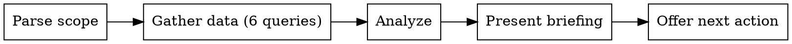

I'm using the sdlc:status skill to get a project briefing.

**REPORT, DON'T ACT**

<HARD-GATE>
Do NOT modify issues, labels, files, or any state. Present the briefing and offer next actions. The user or another skill acts on your recommendations.
</HARD-GATE>

## Process Flow



---

This skill is **read-only** — it never modifies issues, labels, files, or any other state. Its sole purpose is situational awareness.

---

## Step 1: Determine Scope

Parse `$ARGUMENTS` to determine the query scope:

| Input | Scope |
|-------|-------|
| _(empty)_ | Full PI — all stories regardless of area |
| Area name | Stories with `area:<arg>` label. Read `.claude/sdlc/prd/PRD.md` Label Taxonomy section to discover valid area names. If no PRD exists, treat any argument as a raw `area:<arg>` filter. |
| `epic #N` | Stories whose body references `Epic: #N` in the `## Parent` section |

Set `AREA_FILTER` accordingly:
- Full PI: no area filter applied
- Area filter: append `--label "area:<area>"` to each `gh issue list` command below
- Epic scope: use text search `--search "Epic: #N in:body"` on the story queries, then also fetch the epic itself with `gh issue view N --json number,title,body,labels,state`

If `$ARGUMENTS` is non-empty and does not match the pattern `epic #N`, treat it as an area name. Apply `--label "area:<arg>"` to all queries. If the filter returns no results, announce: "No stories found with label `area:<arg>`. Check the PRD's Label Taxonomy for valid areas, or run with no argument for full PI scope." and stop.

---

## Step 2: Gather State

Run all queries now. Do not skip any — each feeds a different section of the briefing.

### 2a. In-Progress Stories

```bash
gh issue list \
  --state open \
  --label "status:in-progress" \
  --label "type:story" \
  --json number,title,labels,assignees,createdAt \
  [--label "area:<area>" if area filter]
```

### 2b. Blocked Stories

```bash
gh issue list \
  --state open \
  --label "status:blocked" \
  --label "type:story" \
  --json number,title,labels,body \
  [--label "area:<area>" if area filter]
```

### 2c. Ready Stories (status:todo, unblocked)

```bash
gh issue list \
  --state open \
  --label "status:todo" \
  --label "type:story" \
  --json number,title,labels,body \
  [--label "area:<area>" if area filter]
```

### 2d. Recently Closed Stories (last 7 days)

Compute the cutoff date (today minus 7 days in ISO 8601 format, e.g. `2026-03-12`), then:

```bash
gh issue list \
  --state closed \
  --label "type:story" \
  --json number,title,closedAt \
  --jq '[.[] | select(.closedAt > "YYYY-MM-DD")]' \
  [--label "area:<area>" if area filter]
```

Replace `YYYY-MM-DD` with the actual computed cutoff date.

### 2e. PI Context

```bash
gh issue list --label "type:pi" --state open --json number,title,body --jq '.[0]'
```

If no open PI issue is found, skip this step silently — PI context is supplementary.

### 2f. Stale Drafts

```bash
ls -la .claude/sdlc/drafts/ 2>/dev/null
```

If the directory does not exist or is empty, skip this step. Otherwise note each file's name and modification date.

---

## Step 3: Analyze

### 3a. In-Progress Analysis

For each in-progress story:
- Calculate age: days since `createdAt` (round to nearest day; show "< 1 day" for same-day)
- List assignees (show `unassigned` if empty)
- Flag as **stale** if age > 5 days (mark with `[STALE]`)

### 3b. Root Blocker Tracing

For each blocked story:

1. Parse `Blocked by:` from the issue body. Extract issue numbers (e.g., `Blocked by: #48, #52` → `[48, 52]`).

   ```bash
   gh issue view <blocked-number> --json body \
     --jq '.body | capture("Blocked by: (?<refs>#[\\d, #]+)") | .refs | split(", ") | map(ltrimstr("#") | tonumber)'
   ```

2. For each blocker number, check its status:

   ```bash
   gh issue view <blocker-number> --json number,title,state,labels \
     --jq '{number, title, state, labels: [.labels[].name]}'
   ```

3. A blocker is **satisfied** if: `state == "CLOSED"` OR labels contain `"status:done"`.
   A blocker is **unmet** if: `state == "OPEN"` AND labels do NOT contain `"status:done"`.

4. For each **unmet** blocker, repeat steps 1–3 recursively on THAT blocker's `Blocked by` field. Continue until you reach either a satisfied blocker or an issue with no `Blocked by` entry.

5. The **root blocker** is the deepest unmet issue in the chain — the one blocking everything above it. If there are multiple chains, trace each independently.

6. Count how many blocked stories a root blocker unblocks transitively (to report "unblocks N stories when done").

### 3c. Ready Story Ranking

For each ready story, extract the priority label:
- `priority:critical` → rank 1
- `priority:high` → rank 2
- `priority:medium` → rank 3
- `priority:low` → rank 4
- _(no priority label)_ → rank 5

Sort ready stories by rank ascending (critical first). Within the same rank, preserve the original `gh issue list` order (most recently created first).

### 3d. Parallelization Analysis

Two ready stories can run in parallel if they have **no dependency relationship** with each other:
- Story A does NOT appear in story B's `Blocked by` or `Blocks` fields
- Story B does NOT appear in story A's `Blocked by` or `Blocks` fields
- They do not share a common unsatisfied blocker

Parse `Blocked by:` and `Blocks:` from each ready story's body. Build a dependency set for each story. Then identify groups of stories with disjoint dependency sets — those can run simultaneously in separate worktrees.

If there are 4+ ready stories, identify the top 2–3 parallelization opportunities rather than listing all combinations.

### 3e. Stale Draft Detection

For each file found in `.claude/sdlc/drafts/`:
- Parse the modification date from `ls -la` output
- A draft is **stale** if its modification date is more than 7 days ago
- Note the filename and age in days

### 3f. Momentum Calculation

- Total PI stories closed: count of all closed `type:story` issues. If PI issue loaded, compare against planned total.
- Stories closed in last 7 days: count from Step 2d.
- Stories remaining: in-progress + blocked + ready counts combined.

---

## Step 4: Present Briefing

Output the briefing using this exact format. Omit any section that has zero items (except Momentum — always show it).

```
## Current PI: <PI name from active PI issue, or "No active PI" if not found>

### In Progress (<count>)
- #<N> <title> (<area>) — <age> [STALE if applicable]
  Assigned: <assignee login or "unassigned">

### Blocked (<count>)
- #<N> <title> ← waiting on #<blocker>
- #<N> <title> ← waiting on #<mid> ← #<root>
  → Root blocker: #<root-N> <root title> (<status>) — unblocks <X> stories when done

### Ready to Pick Up (<count>, ranked)
1. #<N> <title> (<area>, <priority>)
2. #<N> <title> (<area>, <priority>)
...

### Can Parallelize
- Worktree A: #<N> (<area>) — <reason it's independent>
- Worktree B: #<N> or #<N> (<area>) — <reason it's independent>

### Stale Drafts
- <filename> (<age> days old)

### Momentum
- <total closed> stories closed this PI, <remaining> remaining
- <recent count> stories closed in last 7 days
```

**Example output (for reference — replace with real data):**

```
## Current PI: PI-1 — MVP Foundation

### In Progress (2)
- #48 Token encryption (auth) — 2 days
  Assigned: chakraborty29
- #55 Chat UI scaffold (ui) — 1 day
  Assigned: unassigned

### Blocked (3)
- #52 Session history API ← waiting on #48
- #60 Calendar tool ← waiting on #52 ← #48
  → Root blocker: #48 (in progress, unblocks 2 stories when done)
- #63 Search indexing ← waiting on #61 (not started)

### Ready to Pick Up (4, ranked)
1. #61 Vector store setup (search, priority:critical)
2. #57 Error boundary component (ui, priority:high)
3. #58 Loading states (ui, priority:medium)
4. #62 Rate limiter middleware (api, priority:medium)

### Can Parallelize
- Worktree A: #61 (search) — independent of all ui stories
- Worktree B: #57 or #58 (ui) — no dependency on #61

### Stale Drafts
- epic-auth.md (12 days old)

### Momentum
- 8 stories closed this PI, 12 remaining
- 3 stories closed in last 7 days
```

---

## Step 5: Offer Next Action

After presenting the briefing, output exactly:

> Want to pick up one of these? I can start implementation or run `/sdlc:define story` if a ready story needs more detail before starting.

Do not ask follow-up questions or take any action. This skill is read-only — the user decides what to do next.

---

## Execution Checklist

Before finishing, verify ALL steps were completed:

- [ ] Step 1: Scope determined from `$ARGUMENTS`
- [ ] Step 2a: In-progress stories fetched
- [ ] Step 2b: Blocked stories fetched
- [ ] Step 2c: Ready stories fetched
- [ ] Step 2d: Recently closed stories fetched
- [ ] Step 2e: Active PI issue fetched (or skipped if not found)
- [ ] Step 2f: Drafts directory scanned (or skipped if missing)
- [ ] Step 3a: In-progress age and stale flag computed
- [ ] Step 3b: Root blockers traced (not just immediate blockers)
- [ ] Step 3c: Ready stories ranked by priority
- [ ] Step 3d: Parallelization opportunities identified
- [ ] Step 3e: Stale drafts identified
- [ ] Step 3f: Momentum numbers computed
- [ ] Step 4: Briefing presented in the specified format
- [ ] Step 5: Next action offer output

If any step was skipped without a documented skip condition, go back and complete it now.
