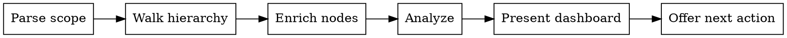

I'm using the sdlc:status skill to get a project briefing.

**REPORT, DON'T ACT**

<HARD-GATE>
Do NOT modify issues, labels, files, or any state. Present the briefing and offer next actions. The user or another skill acts on your recommendations.
</HARD-GATE>

## Process Flow



---

This skill is **read-only** — it never modifies issues, labels, files, or any other state. It builds a hierarchy tree from the active PI downward, then derives actionable insights from it.

---

## Step 1: Determine Scope

Parse `$ARGUMENTS` to determine the display scope:

| Input | Scope |
|-------|-------|
| _(empty)_ | Full PI — all items regardless of area |
| Area name | Filter display to items with `area:<arg>` label. Read `.claude/sdlc/prd/PRD.md` Label Taxonomy section to discover valid area names. If no PRD exists, treat any argument as a raw `area:<arg>` filter. |
| `epic #N` | Filter display to a single epic subtree |

Set `SCOPE_MODE` accordingly:
- **Full PI**: no filter applied — display the entire tree
- **Area filter**: the full tree is still built (so cross-area dependency chains are traced correctly), but only items with the matching `area:<arg>` label and their ancestors are shown in the dashboard
- **Epic scope**: the hierarchy walk only descends into the specified epic (prune at walk time). For dependency analysis, if a blocker points outside the epic, fetch that issue individually to trace the chain.

If `$ARGUMENTS` is non-empty and does not match the pattern `epic #N`, treat it as an area name.

---

## Step 2: Walk Hierarchy

Build the project tree top-down: PI → Epics → Features → Stories.

### 2a. Bulk Fetch

Fetch all issues in two queries to minimize API calls:

```bash
# All open issues
gh issue list \
  --state open \
  --json number,title,body,labels,state,assignees,createdAt \
  --limit 200

# Recently closed issues (for momentum)
gh issue list \
  --state closed \
  --json number,title,body,labels,state,closedAt \
  --limit 100
```

Build a lookup map keyed by issue number. If the open query returns exactly 200 results, note that some issues may be missing — fall back to individual `gh issue view` for any issue referenced in the hierarchy but not found in the cache.

### 2b. Identify Active PI

From the bulk cache, find the issue with a `type:pi` label that is open.

```
Filter: labels contains "type:pi" AND state == "OPEN"
```

If no open PI issue found: output the "No active PI" dashboard (PI Overview only + stale drafts if any) and skip to Step 5.

Parse the PI body's `## Epics` section for epic issue numbers. Match using the format:

```
### Epic: <name> (#<number>)
```

Regex: `### Epic: .+ \(#(\d+)\)`

Collect all matched numbers into `EPIC_NUMS`. If an epic subsection has no `(#N)` (e.g., `### Epic: <name>` without a number), log a warning: "Epic '<name>' has no linked issue number — skipping." and skip that entry.

If `SCOPE_MODE` is epic filter, restrict `EPIC_NUMS` to contain only the requested epic number. If that number is not found in the PI body, warn: "Epic #N is not listed in the active PI." but proceed with fetching it directly.

### 2c. Walk Epics → Features

For each epic number in `EPIC_NUMS`, look up the issue from the cache (or fetch via `gh issue view <N> --json number,title,body,labels,state` if not cached).

Parse the epic body's `## Features` section. Feature references use checklist format:

```
- [ ] <title> (#<number>)
- [x] <title> (#<number>)
```

Regex: `- \[[ x]\] .+ \(#(\d+)\)`

Collect feature numbers for this epic. Also scan the epic body for `## Bugs` or `## Chores` sections using the same checklist pattern — include discovered bugs/chores as children of the epic.

### 2d. Walk Features → Stories

For each feature number, look up from cache.

Check the feature's labels for size classification:
- `size:large` → parse `## Stories` section for story numbers using the same checklist regex
- `size:small` → the feature itself is a leaf work item, no stories to parse
- No size label → treat as `size:small` (leaf)

For `size:large` features, also scan for `## Bugs` or `## Chores` sections — include as children.

### 2e. Leaf Nodes (Stories, Bugs, Chores)

For each story/bug/chore number discovered, look up from cache. These are the leaf nodes of the tree. Store: number, title, labels, state, assignees, createdAt, closedAt (if closed), body.

### 2f. Stale Drafts Scan

```bash
# All draft files with modification dates
ls -la .claude/sdlc/drafts/ 2>/dev/null

# Stale drafts (modified more than 7 days ago)
find .claude/sdlc/drafts/ -type f -mtime +7 2>/dev/null
```

If the directory does not exist or is empty, skip. Otherwise note each file's name and modification date. Use the `find` output to identify stale drafts directly.

### Edge Cases

- **Missing/deleted issue** — referenced number not in cache AND `gh issue view` returns an error: log "Issue #N referenced in <parent> but not found (deleted or transferred). Skipping." Continue the walk.
- **PI with no parseable epics** — show PI Overview with `0/0 epics`. Add note: "PI has no epics listed. Run `/sdlc:define epic` to add one."
- **Epic with no features** — include the epic in the tree with zero children. It will appear in PI Overview counts but not in other sections.
- **Feature with no stories and no size label** — treat as size:small leaf.

---

## Step 3: Enrich Nodes

After the tree is built, compute derived data for each node.

### 3a. Status Classification

For each node, determine effective status from labels:

| Label | Status |
|-------|--------|
| `status:in-progress` | IN_PROGRESS |
| `status:blocked` | BLOCKED |
| `status:todo` | TODO |
| `status:done` OR state=CLOSED | DONE |

Epics and features typically do not carry status labels. For these, **derive status from children** using this precedence (first match wins):
1. Any child IN_PROGRESS → IN_PROGRESS
2. Any child TODO (and none in-progress) → TODO (actionable work exists)
3. All remaining children BLOCKED or DONE (but not all DONE) → BLOCKED
4. All children DONE → DONE

### 3b. Dependency Extraction

For each node, parse the `## Dependencies` section of the issue body:

- Lines matching `- Blocked by: #N` or `- Blocked by: #N, #M` → extract blocker issue numbers
- Lines matching `- Blocks: #N` or `- Blocks: #N, #M` → extract blocked issue numbers

Build:
- `blockers_of[N]` → list of issue numbers that block N
- `blocks[N]` → list of issue numbers that N blocks

### 3c. Age Calculation

For each IN_PROGRESS item:
- Calculate age: days since `createdAt` (round to nearest day; show "< 1 day" for same-day)
- Flag as **STALE** if age > 5 days

Note: Age is calculated from issue creation date, not from when `status:in-progress` was applied. This is an approximation to avoid additional Timeline API calls per issue. For stories that sat in TODO for a long time before starting, the age may appear inflated.

### 3d. Completion Counts

For each parent node (PI, epic, feature), count children by status:
- `done_count` — children that are DONE
- `total_count` — total children
- `in_progress_count`, `blocked_count`, `todo_count` — for derived status

These feed PI Overview and Momentum sections.

---

## Step 4: Analyze

### 4a. Root Blocker Tracing

For each BLOCKED node:

1. Extract blocker numbers from `blockers_of[N]`.
2. For each blocker, check its status: DONE or state=CLOSED → **satisfied**. Otherwise → **unmet**.
3. For each unmet blocker, recurse: check ITS `blockers_of` and repeat.
4. Track a `visited` set to detect circular dependencies. If a cycle is found, report: "Circular dependency detected: #A → #B → #A. Run `/sdlc:reconcile` to diagnose." Stop tracing that chain.
5. The **root blocker** is the deepest unmet issue in the chain.
6. Count how many items a root blocker transitively unblocks.

**Hierarchy insight** — for each blocked item, check if it is the *last remaining* un-done item under its parent. If so:
- "Last story in Feature #F — resolving this completes the feature"
- If the feature completing would also complete the epic: "Gates Feature #F completion, which gates Epic #E"

Group blocked items by root blocker in the output.

### 4b. Impact Scoring (What's Next ranking)

For each TODO item (candidate for What's Next), compute an impact score:

| Component | Points | Condition |
|-----------|--------|-----------|
| Completes feature | 4 | This is the last un-done item under its parent — all siblings are DONE |
| Unblocks siblings | 3 | This item's number appears in a sibling's `Blocked by` list |
| Gates parent completion | 2 | Completing this (plus already-done siblings) would complete the parent, AND that parent completing would complete its own parent |
| Priority weight | 0–1 | critical=1.0, high=0.75, medium=0.5, low=0.25, none=0 |

**Score** = sum of all applicable component points.

**Algorithm:**
1. For each TODO item N, look up its parent P in the tree.
2. Count how many siblings of N are DONE vs total siblings.
3. If `(done_siblings + 1) == total_siblings` → "completes feature" = 4 points.
4. Check if N's number appears in any sibling's `blockers_of` list → "unblocks siblings" = 3 points (also note which siblings).
5. If "completes feature" is true, check if parent P completing would complete P's parent → "gates parent" = 2 points.
6. Add priority weight from N's labels.
7. Sort all TODO items by score descending. Ties broken by priority label rank (critical > high > medium > low > none), then by issue number ascending (older first).

### 4c. Parallelization Analysis

Identify independent work streams at the highest meaningful level.

**Level 1 — Epic-level parallelization:**
1. Group all TODO leaf items by their epic ancestor.
2. If TODO items exist under 2+ different epics → those are independent streams. Report at epic level.

**Level 2 — Feature-level parallelization (within a single epic):**
1. Group TODO leaf items by their feature ancestor.
2. Two features are independent if no TODO item in feature A has a dependency edge (blockers_of or blocks) pointing to any item in feature B.
3. If independent features found → report at feature level.

**Level 3 — Story-level parallelization (within a single feature):**
1. Two TODO items are independent if neither appears in the other's `blockers_of` or `blocks` lists, and they share no common unmet blocker.
2. If independent stories found → report at story level.

Always report at the highest applicable level. If epic-level parallelization exists, do not redundantly list feature-level within those epics.

### 4d. Momentum Calculation

- **Total leaf items in PI**: count all stories + size:small features in the tree (any state).
- **Done items**: count all leaf nodes with status DONE.
- **Remaining**: total - done.
- **Closed in last 7 days**: count leaf nodes where `closedAt` falls within the last 7 calendar days.
- **Closed in previous 7 days** (days 8–14): count for trend comparison.
- **Trend**: if `last_7d > prev_7d` → up. If `last_7d < prev_7d` → down. If equal → flat.

### 4e. Stale Draft Detection

For each file in `.claude/sdlc/drafts/`:
- Parse the modification date from `ls -la` output
- A draft is **stale** if its modification date is more than 7 days ago
- Note the filename and age in days

---

## Step 5: Present Dashboard

Load the dashboard template from `${CLAUDE_PLUGIN_ROOT}/skills/status/reference/dashboard-template.md` for reference on the output format.

Populate each section with the analyzed data. Follow these rules:

- **Always show**: PI Overview, Momentum
- **Omit if zero items**: In Progress, Blocked, What's Next, Parallelization
- **Omit if no stale drafts**: Stale Drafts callout
- **Section order is rigid**: PI Overview → In Progress → Momentum → Blocked → What's Next → Parallelization → Stale Drafts
- **Area filter**: when active, only show items with the matching area label (and their ancestors for context). Dependency analysis in Blocked still traces cross-area chains.

---

## Step 6: Offer Next Action

After presenting the dashboard, output exactly:

> Want to pick up one of these? I can start implementation or run `/sdlc:define story` if a ready item needs more detail first.

Do not ask follow-up questions or take any action. This skill is read-only — the user decides what to do next.

---

## Execution Checklist

Before finishing, verify ALL steps were completed:

- [ ] Step 1: Scope determined from `$ARGUMENTS`
- [ ] Step 2a: Bulk fetch of open and closed issues completed
- [ ] Step 2b: Active PI identified and epic numbers parsed from body
- [ ] Step 2c: Each epic fetched and features parsed
- [ ] Step 2d: Each feature fetched, size checked, stories parsed (or noted as leaf)
- [ ] Step 2e: Each story/bug/chore leaf node fetched
- [ ] Step 2f: Stale drafts directory scanned (or skipped if missing)
- [ ] Step 3a: Status classification applied to all nodes (derived for parents)
- [ ] Step 3b: Dependencies extracted from all node bodies
- [ ] Step 3c: Age calculated for in-progress items, STALE flags set
- [ ] Step 3d: Completion counts computed for all parent nodes
- [ ] Step 4a: Root blockers traced recursively with hierarchy insights
- [ ] Step 4b: Impact scores computed for all TODO items
- [ ] Step 4c: Parallelization analyzed at epic > feature > story level
- [ ] Step 4d: Momentum calculated with 7-day trend
- [ ] Step 4e: Stale drafts flagged (>7 days)
- [ ] Step 5: Dashboard presented following reference template section order
- [ ] Step 6: Next action offer output

If any step was skipped without a documented skip condition, go back and complete it now.
