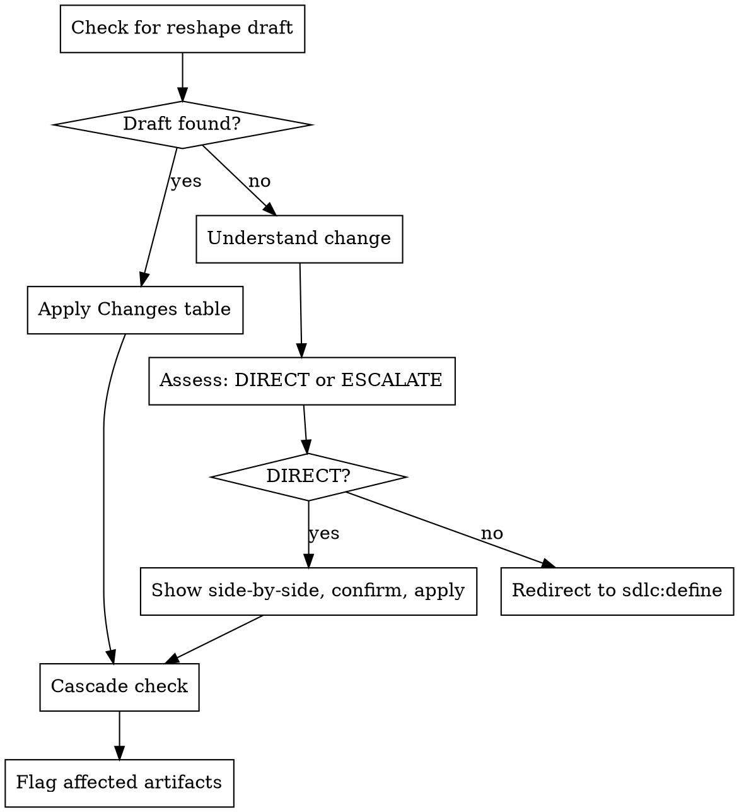

I'm using the sdlc:update skill to update an existing SDLC artifact.

**NO SILENT SCOPE CHANGES — DIRECT OR ESCALATE**

<HARD-GATE>
Do NOT make changes that cross the DIRECT UPDATE boundary without escalating to sdlc:define. Do NOT combine multiple independent changes into one update.
</HARD-GATE>

## Process Flow



---

This skill is a **surgical editor**: small changes go through directly, large changes get redirected to `sdlc:define` for proper reshaping. Two tiers only — no fuzzy middle ground.

---

## Red Flags (anti-rationalization)

Before starting, internalize these. Check back if you feel tempted to stretch a direct update.

| Thought | Reality |
|---------|---------|
| "This is borderline, I'll just do a direct update" | If in doubt, escalate to define. The threshold is objective — check the criteria in Step 3. |
| "I can handle adding a story without escalating" | Adding children = ESCALATE. No exceptions. |
| "The reshape draft seems wrong, let me fix it myself" | If the draft has issues, redirect to sdlc:define. Don't edit someone else's brainstorming output. |
| "I'll skip the side-by-side comparison" | Step 4 requires showing current vs proposed. The user must confirm before any mutation. |
| "Cascade updates are automatic" | Every cascade change requires explicit user confirmation. Flag, don't act. |
| "I'll update the dependency in one direction only" | Dependency linking is ALWAYS bidirectional. Update both `Blocked by` and `Blocks`. |

---

## Step 1: Load Current State

### 1a. Parse Arguments

Extract the artifact level and identifier from `$ARGUMENTS`.

- Valid levels: `prd`, `pi`, `epic`, `feature`, `story`
- Identifier: issue number (for epic/feature/story), or omitted (for prd/pi)
- If `$ARGUMENTS` is empty or unclear, ask: **"What are we updating? (e.g., `story #45`, `prd`, `epic #12`)"** and STOP until the user answers.

### 1b. Check for Reshape Draft

Look for a reshape draft produced by `sdlc:define`:

```bash
ls .claude/sdlc/drafts/<level>-*.md 2>/dev/null
```

If a draft exists for this artifact (matching level and identifier), read it:

```
Read .claude/sdlc/drafts/<filename>
```

Check if the draft has a `## Changes` section. If yes:
- This is a **reshape draft** — the changes are pre-defined. Skip Step 2 and Step 3.
- Announce: "Found reshape draft: `<filename>`. The Changes section defines what to apply."
- Proceed directly to Step 4 (RESHAPE DRAFT path).

### 1c. Fetch Current State (no draft)

If no reshape draft was found, fetch the current state of the artifact:

**PRD:**
```
Read .claude/sdlc/prd/PRD.md
```

**PI:**
```
Read .claude/sdlc/pi/PI.md
```

**Epic / Feature / Story:**
```bash
gh issue view <number> --json number,title,body,labels,state
```

If the artifact does not exist (file missing, issue not found), STOP: "Could not find `<level>` `<identifier>`. Check the identifier and try again."

### 1d. Load Update Reference

```
Read ${CLAUDE_PLUGIN_ROOT}/skills/update/reference/<level>-update.md
```

If the file does not exist or fails to load, STOP: "The update reference for `<level>` is missing. Cannot proceed."

---

## Step 2: Understand the Change

**Skip this step if a reshape draft was loaded in Step 1b.**

Ask the user: **"What do you want to change?"**

Wait for the user's response. Then validate the request:

- If the change seems risky (removing acceptance criteria, changing scope significantly), challenge it:
  > "Are you sure you want to [description]? This was there because [reason from context]."
- If the user confirms, proceed.
- If the change is straightforward, proceed without challenge.

---

## Step 3: Assess Magnitude

**Skip this step if a reshape draft was loaded in Step 1b.**

Apply these criteria strictly. Two tiers only.

### DIRECT UPDATE — all must be true:

- **1-2 fields changing** (title, description section, priority, a few ACs, technical notes, file scope)
- **No children added or removed** (no new features under an epic, no new stories under a feature)
- **No new dependencies introduced** (no new `Blocked by` or `Blocks` entries that weren't there before — updating existing deps is fine)
- **No scope expansion** (the artifact doesn't grow to cover new areas or fundamentally different work)

### ESCALATE TO DEFINE — any one triggers escalation:

- **3+ fields changing**
- **Adding or removing children** (features under an epic, stories under a feature)
- **New dependencies introduced** (new `Blocked by` or `Blocks` that weren't there)
- **Scope change** (the artifact now covers different/additional areas)
- **User says "let's rethink this"**, "reshape", "rework", or similar

Announce the assessment:

> "This is a **direct update** — changing [field1] and [field2], no structural changes."

or:

> "This needs escalation — [reason]. I'll redirect to `sdlc:define` for proper reshaping."

---

## Step 4: Execute

Follow the path determined by Step 3 (or Step 1b for reshape drafts).

### Path A: DIRECT UPDATE

**1. Show side-by-side comparison:**

For each field being changed, show:

```
**[Field Name]**
  Current: <current value>
  Proposed: <new value>
```

**2. Get confirmation:**

> "Apply these changes?"

STOP and wait for user confirmation. Do not apply changes without explicit approval.

**3. Apply changes using the reference file commands.**

The update reference loaded in Step 1d contains the exact commands for this level:
- PRD/PI: edit local file + git commit
- Epic/Feature/Story: `gh issue edit` commands (read-modify-write for body changes, label flags for label changes)

Follow the reference exactly. Each change is a separate command — do not batch unrelated changes.

**4. Handle dependency updates:**

If a dependency field changed (`Blocked by` or `Blocks`), the reference file contains bidirectional linking instructions. Follow them — update BOTH the current artifact AND the referenced artifact.

**Note:** Dependency changes under direct update are limited to correcting an existing reference (e.g., fixing a wrong issue number). Adding a NEW dependency relationship (a new `Blocked by` or `Blocks` entry that wasn't there before) always escalates to define per Step 3.

**5. Handle status label updates:**

If a dependency change affects whether the artifact is blocked, recalculate the status label per the reference file. A blocker is **satisfied** if the blocking issue has `status:done` label OR state is `CLOSED`. A blocker is **unmet** if the issue is `OPEN` without `status:done`.

### Path B: ESCALATE TO DEFINE

Tell the user:

> "This is a significant change. I'll invoke `/sdlc:define <level>` to reshape this properly."
>
> Here's what will happen:
> 1. `sdlc:define` will load the current state of `<level>` `<identifier>` and brainstorm the changes with you.
> 2. It will produce a draft with a `## Changes` section documenting what to modify.
> 3. You can then re-invoke `/sdlc:update <level> <identifier>` to apply the changes surgically.

STOP. Do not attempt the changes yourself.

### Path C: RESHAPE DRAFT (from Step 1b)

When a reshape draft with a `## Changes` section was loaded:

**1. Present the changes from the draft:**

Read the `## Changes` section. Show the summary line and the changes table to the user.

> "The reshape draft defines these changes:"
>
> [paste the Changes table from the draft]
>
> "Apply all changes?"

STOP and wait for user confirmation.

**2. Apply each change surgically:**

Walk through the Changes table row by row. For each row:
- Identify the section/field being changed
- Use the reference file commands to apply the specific change
- Each change is its own `gh issue edit` command (for GitHub artifacts) or targeted file edit (for PRD/PI)

**3. Handle cascading effects from the changes:**

If any change in the table affects dependencies or parent/child relationships, apply the bidirectional updates per the reference file.

**4. Offer to clean up the draft:**

> "All changes applied. Delete the reshape draft `.claude/sdlc/drafts/<filename>`?"

- If yes: `rm .claude/sdlc/drafts/<filename>`
- If no: leave the draft. Note that `sdlc:status` will flag stale drafts.

---

## Step 5: Cascade Logic

After applying changes (from any path), check if parents or children are affected.

### When to flag cascades:

- **Title changed** on a story/feature: the parent's checklist may reference the old title
- **Priority changed** on an epic: child features/stories may inherit the old priority
- **Scope changed**: child artifacts may need updates to match
- **Dependency changed**: linked issues may need their `Blocked by`/`Blocks` sections updated (this is handled in Step 4, not here)
- **Status changed**: parent progress may be affected

### How to flag:

> "These artifacts may need updates after this change:"
> - Feature #12 — checklist references old story title
> - Story #14 — inherits priority from this epic
>
> "Want me to check and update them?"

STOP and wait for user confirmation before cascading.

### Cascade execution:

- Each cascade update is its own individual operation
- Read the artifact, show what would change, get confirmation, apply
- Follow the same reference file commands for each cascaded artifact
- Do NOT chain cascades — if updating artifact A reveals that artifact B also needs updating, flag B separately

---

## Execution Checklist

Before finishing, verify ALL steps were completed:

- [ ] Step 1: Current state loaded (or reshape draft found)
- [ ] Step 1d: Update reference loaded
- [ ] Step 2: Change understood (or skipped for reshape draft)
- [ ] Step 3: Magnitude assessed (or skipped for reshape draft)
- [ ] Step 4: Changes applied with user confirmation
- [ ] Step 5: Cascade effects checked and flagged

If any step was skipped (other than the documented skip conditions for reshape drafts), GO BACK and complete it now.
