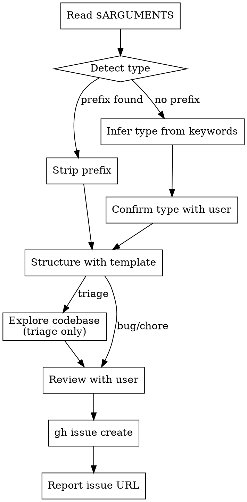

# Bug/Chore/Triage Templates Implementation Plan

> **For agentic workers:** REQUIRED SUB-SKILL: Use superpowers:subagent-driven-development (recommended) or superpowers:executing-plans to implement this plan task-by-task. Steps use checkbox (`- [ ]`) syntax for tracking.

**Goal:** Expand the capture skill with type-aware bug/chore/triage templates and teach define to recognize bug and chore types.

**Architecture:** Four new markdown files (3 templates + 1 brainstorm guide) following existing patterns, plus modifications to two skill files (capture SKILL.md and define SKILL.md). All files are prompt/template markdown — no application code.

**Tech Stack:** Markdown, YAML frontmatter, GitHub CLI (`gh`), git

**Spec:** `docs/superpowers/specs/2026-03-22-bug-chore-triage-templates-design.md`

---

## File Map

**Create:**
- `.claude/plugins/sdlc/templates/bug-template.md` — Bug draft output format
- `.claude/plugins/sdlc/templates/chore-template.md` — Chore draft output format
- `.claude/plugins/sdlc/templates/triage-template.md` — Triage capture output format
- `.claude/plugins/sdlc/skills/define/reference/bug-brainstorm.md` — Bug investigation checklist for define

**Modify:**
- `.claude/plugins/sdlc/skills/capture/SKILL.md` — Type detection, new grounding, light-ceremony review, template loading, triage exploration
- `.claude/plugins/sdlc/skills/define/SKILL.md` — Phase 1 type recognition, brainstorm guide loading, pre-flight checks, description update

---

### Task 1: Create bug template

**Files:**
- Create: `.claude/plugins/sdlc/templates/bug-template.md`
- Reference: `.claude/plugins/sdlc/templates/story-template.md` (pattern to follow)

- [ ] **Step 1: Write bug-template.md**

Follow the exact structure of `story-template.md`: title heading, preamble paragraph, `## Frontmatter` with YAML code block, `## Required Sections` as bullet list.

```markdown
# Bug Template

The canonical output format for Bug drafts. Bugs are GitHub Issues with `type:bug` label. Bugs are peers to the hierarchy — they have no parent epic or feature, only dependency relationships.

## Frontmatter

\```yaml
---
type: bug
name: <bug name>
severity: <critical|high|medium|low>
priority: <critical|high|medium|low>
areas: [<area labels>]
status: draft
---
\```

## Required Sections

- `## Description` — What's broken, when/how it manifests, any error messages or symptoms
- `## Reproduction Steps` — Steps to reproduce the bug (or "Not yet reproduced" with known context)
- `## Expected vs Actual Behavior` — What should happen vs what does happen
- `## Affected Areas` — Which parts of the system are impacted
- `## File Scope` — Known files involved (may be partial at capture, filled by define)
- `## Dependencies` — Bidirectional format: `- Blocked by: #N` / `- Blocks: #N` (or `none`)
```

Note: No `## Parent` section. No conditional sections. No validation rules (all sections are always required).

- [ ] **Step 2: Verify against pattern**

Read `story-template.md` and `bug-template.md` side-by-side. Verify:
- Same heading structure (H1 title, preamble, `## Frontmatter`, `## Required Sections`)
- Frontmatter uses YAML code block with `---` delimiters
- Sections listed as bullet points with backtick-wrapped heading + em dash + description
- `severity` field is present in frontmatter (unique to bugs)
- No parent fields in frontmatter

- [ ] **Step 3: Commit**

```bash
git add .claude/plugins/sdlc/templates/bug-template.md
git commit -m "feat(templates): add bug template — peer to hierarchy, severity in frontmatter"
```

---

### Task 2: Create chore template

**Files:**
- Create: `.claude/plugins/sdlc/templates/chore-template.md`
- Reference: `.claude/plugins/sdlc/templates/feature-template.md` (pattern for conditional sections)

- [ ] **Step 1: Write chore-template.md**

Follow `feature-template.md` pattern — it has conditional sections and validation rules, which chore also needs.

```markdown
# Chore Template

The canonical output format for Chore drafts. Chores are GitHub Issues with `type:chore` label. Chores can be standalone (no parent) or parented to an epic/feature.

## Frontmatter

\```yaml
---
type: chore
name: <chore name>
priority: <critical|high|medium|low>
areas: [<area labels>]
status: draft
parent-epic: <issue number>    # optional
parent-feature: <issue number> # optional
---
\```

## Required Sections

- `## Description` — What needs to be done and why
- `## Task` — The specific work to perform
- `## Acceptance Criteria` — Checklist of conditions for "done"
- `## File Scope` — Files to create/modify
- `## Dependencies` — Bidirectional format: `- Blocked by: #N` / `- Blocks: #N` (or `none`)

## Conditional Sections

- `## Parent` — **Only if `parent-epic` or `parent-feature` is set**. **Omit entirely if standalone.**
  - Both set: `Epic: #<parent-epic>, Feature: #<parent-feature>`
  - Only epic set: `Epic: #<parent-epic>`
  - Only feature set: `Feature: #<parent-feature>`

## Validation Rules

- If `parent-epic` or `parent-feature` is set, `## Parent` section MUST exist
- If neither parent is set, `## Parent` section MUST be omitted
```

- [ ] **Step 2: Verify against pattern**

Read `feature-template.md` and `chore-template.md` side-by-side. Verify:
- Same heading structure including `## Conditional Sections` and `## Validation Rules`
- Parent fields in frontmatter are marked with `# optional` comments
- Conditional section uses bold emphasis for the condition, matching feature-template's pattern
- Validation rules match the conditional logic

- [ ] **Step 3: Commit**

```bash
git add .claude/plugins/sdlc/templates/chore-template.md
git commit -m "feat(templates): add chore template — optional parent, standalone or parented"
```

---

### Task 3: Create triage template

**Files:**
- Create: `.claude/plugins/sdlc/templates/triage-template.md`
- Reference: `.claude/plugins/sdlc/templates/story-template.md` (simplest pattern)

- [ ] **Step 1: Write triage-template.md**

Triage is the simplest template — no conditional sections, no validation rules, lightest frontmatter.

```markdown
# Triage Template

The canonical output format for Triage captures. Triage issues are raw intake — unsorted and unclassified. They get promoted to a real type via `sdlc:define`.

**Label note:** The GitHub label for triage is `triage` (no `type:` prefix), unlike `type:bug` and `type:chore`. This matches the existing capture skill behavior.

## Frontmatter

\```yaml
---
type: triage
name: <issue name>
areas: [<area labels>]
status: draft
---
\```

## Required Sections

- `## Description` — What was observed or reported
- `## Initial Analysis` — Codebase exploration findings (related files, recent git history, open issues)
- `## Possible Causes` — Hypotheses based on the analysis
- `## Suggested Next Steps` — What to do: define as feature? investigate as bug? handle as chore?
- `## Dependencies` — Bidirectional format (or `none`)
```

Note: No priority, no severity, no parents, no File Scope. Lightest possible frontmatter.

- [ ] **Step 2: Verify against pattern**

Check:
- Same heading structure as other templates
- Frontmatter has only `type`, `name`, `areas`, `status`
- Label note about `triage` vs `type:triage` is present
- No File Scope section (intentional — premature for triage)

- [ ] **Step 3: Commit**

```bash
git add .claude/plugins/sdlc/templates/triage-template.md
git commit -m "feat(templates): add triage template — raw intake with exploration sections"
```

---

### Task 4: Create bug brainstorm guide

**Files:**
- Create: `.claude/plugins/sdlc/skills/define/reference/bug-brainstorm.md`
- Reference: `.claude/plugins/sdlc/skills/define/reference/story-brainstorm.md` (pattern to follow)
- Reference: `.claude/plugins/sdlc/skills/define/reference/feature-brainstorm.md` (for size classification pattern)

- [ ] **Step 1: Write bug-brainstorm.md**

Follow the exact pattern from `story-brainstorm.md`: title, intro line, `## Before you can draft`, `## Context to load`, optional type-specific section, `## Research agent`, `## Template reference`.

```markdown
# Bug Brainstorming Guide

Internal checklist for the define skill. Weave these into natural conversation — do NOT ask them as a list.

## Before you can draft, make sure you understand:

- What exactly is broken? (symptoms, error messages, behavior)
- What's the expected behavior vs actual behavior?
- Can it be reproduced? What are the steps?
- Is this a regression or long-standing? (check git history)
- What's the severity? (critical/high/medium/low)
- Which areas of the system are affected?
- Are there related bugs or issues?
- What's the fix scope? (one file, multiple areas, architectural)
- Does this block or get blocked by any existing work?

## Context to load

- Search codebase for files related to the bug's symptoms
- Check recent git history for changes in affected areas
- Check open issues for related work: `gh issue list --label "type:bug"`
- Read `.claude/sdlc/prd/PRD.md` — check Architecture and Security Constraints if relevant

## Scope note

Bugs have no size/decomposition concept (unlike features with size:small/large). A bug is always a single unit of work. There is no parent to load — bugs are peers to the hierarchy.

## Research agent

For bugs with unclear scope, dispatch a research agent:
- Trace the code path where the bug manifests
- Identify all files in the affected area
- Check for related test coverage
- Look for similar patterns elsewhere that might have the same bug

## Template reference

Draft output format: `${CLAUDE_PLUGIN_ROOT}/templates/bug-template.md`
```

- [ ] **Step 2: Verify against pattern**

Read `story-brainstorm.md` and `bug-brainstorm.md` side-by-side. Verify:
- Same H1 title pattern: `# Bug Brainstorming Guide`
- Same intro line about weaving into conversation
- Same section headings: `## Before you can draft`, `## Context to load`, `## Research agent`, `## Template reference`
- Has a `## Scope note` section (like feature-brainstorm.md has `## Size classification`)
- Template reference uses `${CLAUDE_PLUGIN_ROOT}` variable
- Context to load does NOT reference parent artifacts (bugs have no parents)

- [ ] **Step 3: Commit**

```bash
git add .claude/plugins/sdlc/skills/define/reference/bug-brainstorm.md
git commit -m "feat(define): add bug brainstorm guide — investigation-focused checklist"
```

---

### Task 5: Modify capture SKILL.md

**Files:**
- Modify: `.claude/plugins/sdlc/skills/capture/SKILL.md`
- Reference: Issue #18 Technical Notes for type detection logic and light-ceremony behavior

This is the largest change. The capture skill transforms from a 57-line zero-ceremony triage-only tool into a type-aware light-ceremony skill.

- [ ] **Step 1: Update frontmatter**

Change the description to reflect new capabilities. Add `Read, Grep, Glob` to allowed-tools (needed for triage exploration). Update argument-hint.

Old:
```yaml
---
name: capture
description: Use when you want to quickly capture an idea or task without going through the full sdlc:define ceremony. Creates a minimal GitHub issue with a triage label.
allowed-tools: Bash
argument-hint: "<description of the idea>"
---
```

New:
```yaml
---
name: capture
description: Use when you want to quickly capture an idea, bug, or chore without going through the full sdlc:define ceremony. Creates a GitHub issue with type detection (bug/chore/triage).
allowed-tools: Bash, Read, Grep, Glob
argument-hint: "[bug:|chore:] <description>"
---
```

- [ ] **Step 2: Replace grounding statement and hard gate**

Old grounding: `**CAPTURE, DON'T DESIGN**`
New grounding: `**CAPTURE WITH CONTEXT**`

Old hard gate: `Do NOT ask clarifying questions, assess scope, or brainstorm. Create the issue and report back. If the idea needs fleshing out, tell the user to run sdlc:define.`
New hard gate: `Do NOT brainstorm solutions or design implementations — that's define's job. DO classify the type. DO structure with the appropriate template. DO review the structured capture with the user before creating. DO explore the codebase for context on triage captures.`

- [ ] **Step 3: Replace process flow diagram**

Replace the simple linear flow with the type-detection flow:



- [ ] **Step 4: Replace everything from `---` (line 30) through end of file with the new instructions**

Delete from the `---` separator (after the process flow) through the end of the file, and replace with the following verbatim content:

```markdown
---

### Instructions

#### Step 1: Read and detect type

Read the description from `$ARGUMENTS`.

**Prefix detection (case-insensitive):**
- Starts with `bug:` or `bug ` → type = **bug**, strip the prefix
- Starts with `chore:` or `chore ` → type = **chore**, strip the prefix
- No prefix → go to keyword inference

**Keyword inference (no prefix):**
- Error/crash/fail/broken/regression signals → suggest **bug**
- Cleanup/refactor/migrate/update-deps/rename signals → suggest **chore**
- Everything else → suggest **triage**

Present your classification to the user:
> "This sounds like a **[type]**. Does that feel right, or should it be a [alternative]?"

Wait for confirmation before proceeding. If the user reclassifies, use their choice.

#### Step 2: Derive title

Derive a **concise issue title** (under 80 characters) that captures the essence.

#### Step 3: Structure with template

Load the template for the confirmed type from `${CLAUDE_PLUGIN_ROOT}/templates/<type>-template.md`. Use its sections as the issue body structure. Fill what you can from the description; use `[TBD]` for sections you can't fill.

**Bug — fill from description:**
- `## Description` — what's broken, error messages, symptoms
- `## Reproduction Steps` — steps from description, or "Not yet reproduced — captured from: [original description context]"
- `## Expected vs Actual Behavior` — from description or `[TBD]`
- `## Affected Areas` — if mentioned, otherwise `[TBD]`
- `## File Scope` — if mentioned, otherwise `[TBD]`
- `## Dependencies` — `none` (capture doesn't assess dependencies)

**Chore — fill from description:**
- `## Description` — what needs doing and why
- `## Task` — the specific work
- `## Acceptance Criteria` — if determinable, otherwise `[TBD]`
- `## File Scope` — if mentioned, otherwise `[TBD]`
- `## Dependencies` — `none`
- No `## Parent` section at capture time (standalone by default; can be added via `/sdlc:define chore #N` later)

**Triage — explore first, then fill:**
- **Before structuring**, explore the codebase for context:
  - Search for files related to the description keywords using Grep
  - Check recent git history for related changes: `git log --oneline -20`
  - Scan open issues for related work: `gh issue list --state open --limit 20`
- `## Description` — what was observed or reported
- `## Initial Analysis` — findings from your codebase exploration
- `## Possible Causes` — hypotheses based on the analysis
- `## Suggested Next Steps` — what to do next: define as feature? investigate as bug? handle as chore?
- `## Dependencies` — `none`

#### Step 4: Review with user

Present the structured issue to the user. Show the full body, not a summary.

For bug/chore:
> "Here's what I captured. Anything to add or change?"

For triage:
> "Here's what I found after exploring the codebase. Anything to add before I create the issue?"

Wait for user approval. Incorporate any feedback. Do NOT create the issue until the user confirms.

#### Step 5: Create issue

Create the issue with the appropriate labels:

- **Bug:** `--label "type:bug"` (also add `--label "severity:<level>"` if severity was determined during capture)
- **Chore:** `--label "type:chore"`
- **Triage:** `--label "triage"`

```bash
gh issue create \
  --title "<derived title>" \
  --label "<type label>" \
  --body "<structured body>"
```

#### Step 6: Report and suggest next steps

Report the created issue number and URL.

For bugs and chores:
> "If this needs deeper investigation or decomposition, run `/sdlc:define bug #N` or `/sdlc:define chore #N`."

For triage:
> "Run `/sdlc:define` to flesh out when ready."

Note: `sdlc:reconcile` flags triage issues older than 14 days so nothing gets lost.
```

- [ ] **Step 5: Verify the complete SKILL.md**

Read the modified file and check:
- Frontmatter has updated description, allowed-tools includes Read/Grep/Glob, argument-hint shows prefix options
- Grounding statement is "CAPTURE WITH CONTEXT"
- Hard gate prohibits brainstorming but allows classification, review, and exploration
- Type detection logic matches issue #18 Technical Notes
- All three type paths (bug/chore/triage) are covered
- Each path loads the correct template
- Each path shows the structured issue to user before creating
- Triage path includes codebase exploration
- Labels are correct: `type:bug`, `type:chore`, `triage`

- [ ] **Step 6: Commit**

```bash
git add .claude/plugins/sdlc/skills/capture/SKILL.md
git commit -m "feat(capture): type-aware capture with bug/chore/triage detection and user review"
```

---

### Task 6: Modify define SKILL.md

**Files:**
- Modify: `.claude/plugins/sdlc/skills/define/SKILL.md`

Three changes: update description/frontmatter, add type recognition to Phase 1, add pre-flight checks for bug/chore.

- [ ] **Step 1: Update frontmatter description**

Old:
```yaml
description: Use when defining new SDLC artifacts (PRD, PI, epic, feature, story) or reshaping existing ones through collaborative brainstorming that produces a reviewable local draft.
```

New:
```yaml
description: Use when defining new SDLC artifacts (PRD, PI, epic, feature, story, bug, chore) or reshaping existing ones through collaborative brainstorming that produces a reviewable local draft.
```

- [ ] **Step 2: Add type recognition to Phase 1**

The existing Phase 1 already has a generic rule on line 35:
```
- If level provided: load brainstorming guide from `${CLAUDE_PLUGIN_ROOT}/skills/define/reference/<level>-brainstorm.md`
```

This generic rule already handles `bug` correctly — `bug-brainstorm.md` exists at that path. **Do NOT add a duplicate bug-specific bullet.**

However, `chore` is an exception: there is no `chore-brainstorm.md` — chores reuse `story-brainstorm.md`. And triage-from-labels is new logic. Add these as special cases **after** the existing generic rule (after line 35):

```markdown
- **Exception — chore level:** load `${CLAUDE_PLUGIN_ROOT}/skills/define/reference/story-brainstorm.md` instead (no `chore-brainstorm.md` exists). Note: parent-related questions in the story guide are conditional for chores — standalone chores skip them.
```

Then, inside the "Detect new vs reshape" bullet (line 40), add label-based type detection for issue-number-only args. After the existing reshape detection logic, add:

```markdown
- If args contain only an issue number (#N) with no level keyword: check the issue's labels via `gh issue view <N> --json labels`:
  - Has `type:bug` label → set level to `bug`, load `bug-brainstorm.md` (via the generic rule)
  - Has `type:chore` label → set level to `chore`, load `story-brainstorm.md` (via the chore exception)
  - Has `triage` label → ask the user what level this should become (may be feature, story, bug, or chore)
```

- [ ] **Step 3: Add pre-flight checks for bug and chore**

Add two rows to the Pre-Flight Checks table:

```markdown
| Bug | PRD exists. No parent requirements — bugs are peers to the hierarchy. |
| Chore | PRD exists. If parented, parent epic/feature resolvable via `gh issue view`. |
```

- [ ] **Step 4: Verify the complete SKILL.md**

Read the modified file and check:
- Description includes `bug, chore`
- Phase 1 has bug/chore/triage recognition logic
- Phase 1 handles issue-number-only args with label detection
- Chore note about conditional parent questions is present
- Pre-flight checks table has Bug and Chore rows
- No other phases are modified (Phase 2-9 work as-is with the new types)

- [ ] **Step 5: Commit**

```bash
git add .claude/plugins/sdlc/skills/define/SKILL.md
git commit -m "feat(define): recognize bug and chore types in Phase 1 with brainstorm guide loading"
```

---

### Task 7: Final verification

- [ ] **Step 1: Verify all new files exist**

```bash
ls -la .claude/plugins/sdlc/templates/bug-template.md
ls -la .claude/plugins/sdlc/templates/chore-template.md
ls -la .claude/plugins/sdlc/templates/triage-template.md
ls -la .claude/plugins/sdlc/skills/define/reference/bug-brainstorm.md
```

All four should exist.

- [ ] **Step 2: Verify template consistency**

Check all templates follow the same structural pattern:

```bash
# All templates should have these headings
head -3 .claude/plugins/sdlc/templates/bug-template.md
head -3 .claude/plugins/sdlc/templates/chore-template.md
head -3 .claude/plugins/sdlc/templates/triage-template.md
head -3 .claude/plugins/sdlc/templates/story-template.md
```

All should start with `# <Type> Template` followed by a preamble paragraph.

- [ ] **Step 3: Verify brainstorm guide consistency**

```bash
head -3 .claude/plugins/sdlc/skills/define/reference/bug-brainstorm.md
head -3 .claude/plugins/sdlc/skills/define/reference/story-brainstorm.md
```

Both should start with `# <Type> Brainstorming Guide` followed by the intro line.

- [ ] **Step 4: Cross-reference against issue #18 ACs**

Walk through each AC from the issue and verify it's covered:

| AC | Verification |
|----|-------------|
| Prefix-based type detection | Capture SKILL.md type detection section |
| No-prefix inference + confirmation | Capture SKILL.md keyword analysis + user confirmation |
| Triage codebase exploration | Capture SKILL.md triage path with Grep/Read/gh commands |
| Bug capture with template | Capture SKILL.md bug path loads bug-template.md |
| Chore capture with template | Capture SKILL.md chore path loads chore-template.md |
| Grounding statement updated | Capture SKILL.md: "CAPTURE WITH CONTEXT" |
| Hard gate updated | Capture SKILL.md: prohibits brainstorming, allows review |
| Bug template created | `templates/bug-template.md` exists |
| Chore template created | `templates/chore-template.md` exists |
| Triage template created | `templates/triage-template.md` exists |
| Bug brainstorm guide created | `skills/define/reference/bug-brainstorm.md` exists |
| Define Phase 1 type recognition | Define SKILL.md Phase 1 additions |
| Define label detection on reshape | Define SKILL.md Phase 1 issue-number handling |
| Correct label assignment | Capture SKILL.md: `type:bug`, `type:chore`, `triage` |

- [ ] **Step 5: Final commit (if any cleanup needed)**

Only if verification found issues that needed fixing. Otherwise skip.
